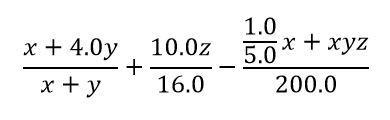

## Question 1  
Write a program to evaluate the following expression.

Each case has one line which contains the value of x, y, and z (Hints: use double as a datatype). The output is the result after evaluating the given expression.
### For example:
| **Input**     | **Result** |
|:--------------|:-----------|
| 1 2 3 | 4.844 |

## Question 2  
Write the program to reformat the message. The given message will be in the form of all lowercase and separate word by a semicolon. The program has to reformat it by replacing semicolons with white space and also capitalizing the first letter of each word.

**Input**  
The only one line of input represent a string.

**Output**  
A formatted message that separate each word by white space and capitalize the first letter.
### For example:
| **Input**     | **Result** |
|:--------------|:-----------|
| nice;to;meet;you;everyone.|Nice To Meet You Everyone.|
|there's;a;lot;of;big;game;in;that;forest.|There's A Lot Of Big Game In That Forest.|
|her;mother;offered;to;send;her;money;every;month,;but;she;was;too;embarrassed;to;accept;it!|Her Mother Offered To Send Her Money Every Month, But She Was Too Embarrassed To Accept It!|
|the;pigs;were;insulted;that;they;were;named;hamburgers.|The Pigs Were Insulted That They Were Named Hamburgers.|
|she;did;a;happy;dance;because;all;of;the;socks;from;the;dryer;matched.|She Did A Happy Dance Because All Of The Socks From The Dryer Matched.|

## Question 3  
Giving the expression, your task is to get the input of basic expression and print the result. The expression consists of two integer values and one operator (basic operators: + - * /). Note that you must use Switch function to write a program.
### For example:
| **Input**     | **Result** |
|:--------------|:-----------|
| 2 + 3 | 5|
| 45 - 10| 35|
|6 * 18|108|
|3195 / 71 | 45|

## Question 4  
Mr. A and Arslan Mrs. B like to drink Cola. They usually challenge each other to drinking a lot of Cola. In each round of challenge, the first person to drink will be random as well as a total number of Cola is also random. The order of drinking is shown in the below table.

| **round**     | **1** |**2** |**3** |**4** |**5** |**...** |**n** |
|:--------------|:------|:------|:------|:------|:------|:------|:------|
| First person | 1| 3 4| 7 8 9 | 13 14 15 16| 21 22 23 24 25| ... | ...|
|Second person| 2| 5 6 | 10 11 12 | 17 18 19 20| 26 27 28 29 30| ... | ...|

Your task is to write a program to check which person will drink the last glass of Cola in order to ensure that both of them drink Cola according to the condition of the challenge. For example, if the first person to drink Cola is A and total number of Cola to drink is 20, the B is the one who drink the last glass of Cola (i.e., the 20th of Cola glass).

The input consists of two data:
1. a person who will drink the first glass of Cola
2. total number of Cola

### For example:
| **Input**     | **Result** |
|:--------------|:-----------|
|A 20|B|
|B 21|B|
|A 30|B|
|B 36|B|
|B 6|A|
|A 54|B|
|A 43|A|
|A 46|A|
