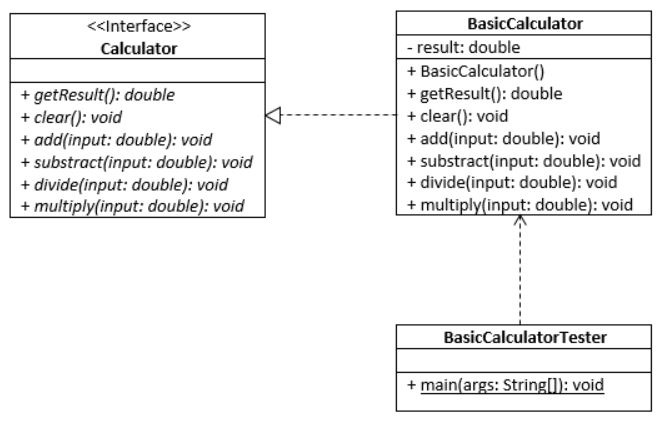
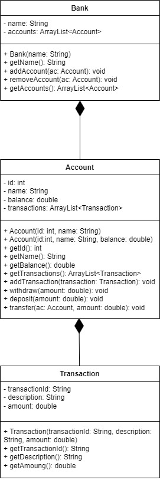
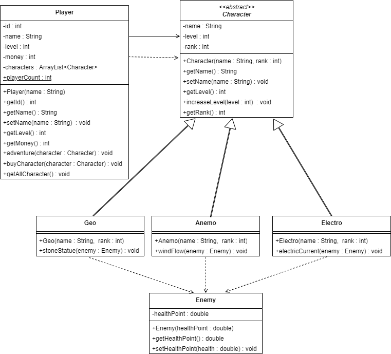

## Question 1
Given a Car class and a driver class called CarCaller, please complete a Car class that supports the driver class.

A Car class should contains the data of car id (int), brand (String), color (String), the name of owner (String), and total driving distance (double). Each data should have getter and setter methods. It should provide at least two constructors: (i) a constructor taking only id as input and (ii) a constructor taking inputs for all attributes (i.e., id, brand, color, and owner name). It also has a method called drive which takes an input of driving distance as double. For each drive, the drive method will accumulate total driving distance for a car. The method getTotalDrivingDist must return total driving distance of a car.

| **Expected**  |
|:--------------|
|----- car1 Info -----<br>id: 15012016 brand: Lamborghini Veneno color: Black owner: James total driving distance: 135.0 <br>----- car2 Info ----- <br>id: 20022011 brand: Jajuar XKR-S color: Blue owner: Paul total driving distance: 350.0 <br>----- car3 Info ----- <br>id: 11112015 brand: Mercedes-AMG GT color: Yello owner: Smith total driving distance: 0.0|

```
class Car {
	//put your code here
}

public class CarCaller {
	public static void main(String[] args){
		Car car1 = new Car(15012016);
		Car car2 = new Car(20022011, "Jajuar XKR-S", "Blue", "Paul");
		Car car3 = new Car(11112015, "Mercedes-AMG GT", "Yello", "Smith");
		
		car1.setBrand("Lamborghini Veneno");
		car1.setColor("Black");
		car1.setOwner("James");
		
		car1.drive(120);
		car2.drive(300);
		car2.drive(50);
		car1.drive(15);
		
		System.out.println("----- car1 Info -----");
		System.out.println("id: "+car1.getId()+ 
				" brand: "+ car1.getBrand() +
				" color: "+ car1.getColor() + 
				" owner: "+ car1.getOwner() +
				" total driving distance: " + car1.getTotalDrivingDist());
		
		System.out.println("----- car2 Info -----");
		System.out.println("id: "+car2.getId()+ 
				" brand: "+ car2.getBrand() +
				" color: "+ car2.getColor() + 
				" owner: "+ car2.getOwner() +
				" total driving distance: " + car2.getTotalDrivingDist());

		System.out.println("----- car3 Info -----");
		System.out.println("id: "+car3.getId()+ 
				" brand: "+ car3.getBrand() +
				" color: "+ car3.getColor() + 
				" owner: "+ car3.getOwner() +
				" total driving distance: " + car3.getTotalDrivingDist());
				
	}
}
```

## Question 2
Write a Java class named Box to represent a box. The class contains:

a.      A named constant ONE_UNIT with value 1.0 to denote the unit length default value.

b.      Three double data field (attributes) named width, height and depth that specify the width, height and depth of the box. The default values are ONE_UNIT for all width, height and depth.

c.       A no-arg (default) constructor that creates a default box.

d.      A constructor that creates a box with the specified width, height and depth.

e.      A method named getCapacity() that returns the volume (capacity) of this box.

f.        A method named getArea() that returns the surface area of this box.

Note that the driver class is provided in the preloaded answer box. Please do not modify the driver class otherwise your result may be incorrect.

### For example:
| **Input**     | **Result** |
|:--------------|:-----------|
|0| Default Box is Created <br> Capacity: 1.0 <br> Surface area: 6.0|
|2<br>5 8 2<br>2.5 4.5 5|Capacity: 80.0<br>Surface area: 132.0<br>Capacity: 56.25<br>Surface area: 92.5|

```
import java.util.Scanner;
public class BoxDriver {
    public static void main(String arg[]) {
        Scanner sc = new Scanner(System.in);
        int box = sc.nextInt();
        if(box!=0){
            for(int i=0;i<box;i++){
                double width = sc.nextDouble();
                double height = sc.nextDouble();
                double depth = sc.nextDouble();
                Box b = new Box(width, height, depth);
                System.out.println("Capacity: "+b.getCapacity());
                System.out.println("Surface area: "+b.getArea());
            }
        }
        else{
            Box b = new Box();
            System.out.println("Default Box is Created");
            System.out.println("Capacity: "+b.getCapacity());
            System.out.println("Surface area: "+b.getArea());
        }
    } 
}

class Box{
    
}
```

## Question 3
Write Java classes according to the given UML Class diagram.




The Calculator class provide an interface for necessary methods that the calculator should have. The BasicCalculator class must provide all implementation of each method in the Calculator class. The explanation of how each constructor and method should be implemented for the BasicCalculator is provided below.

The BasicCalculator constructor will set the initial value of result as 0.

The add method will add the input double to the result.

The substract method will substract the input double from the result.

The divide method will divide the result by the input double.

The multiply method will multiply the result with the input double.

The getResult method returns the current value of result.

The clear method resets the value of result to 0.

The BasicCalculatorTester class is a driver class that uses the BasicCalculator. In details, it will retrieve an input as a mathematics expression (String) and then tokennize the expression into number and operators. Each number will be evaluated according to the input operator, then it returns a result. For example: if the input is "2 *3 + 10 / 8", it should print the result as 2.0.

The code of BasicCalculatorTester is already provided in you programming console. Please DO NOT modify this class, otherwise it may results to the failure. Your task is to write the code of the Calculator class and the BasicCalculator class. Important hint: DO NOT specify the visibility modifier for the Calculator class and the BasicCalculator class. The BasicCalculatorTester must be the only public class in this program.

### For example:
| **Input**     | **Result** |
|:--------------|:-----------|
| 2 * 3 + 10 / 8 | 2.0 |

```
import java.util.Scanner;
import java.util.StringTokenizer;

public class BasicCalculatorTester {
	public static void main(String args[]){
		Scanner sc = new Scanner(System.in);
		BasicCalculator cal = new BasicCalculator();
		String expression = sc.nextLine();
		StringTokenizer st = new StringTokenizer(expression);
		int count = 1;
		String operator = "";
	    while (st.hasMoreTokens()) {
	        //System.out.println(st.nextToken());
	        if(count==1){
				cal.add(Double.parseDouble(st.nextToken()));
			}
			else{
				if(count%2==1){
					operator = st.nextToken();
				}
				else{
					switch(operator){
						case "+": cal.add(Double.parseDouble(st.nextToken())); break;
						case "-": cal.substract(Double.parseDouble(st.nextToken())); break;
						case "/": cal.divide(Double.parseDouble(st.nextToken())); break;
						case "*": cal.multiply(Double.parseDouble(st.nextToken())); break;
					}
				}
			}
	        count++;
	    }
	    System.out.println(cal.getResult());
	}
}

//put your code for the Calculator class below here

//put your code for the BasicCalculator class below here
```

## Question 4
Create a bank system using Java according to the following UML diagram.




The Bank class contains:
- Attribute name (String) and accounts (ArrayList<Account>)

- A constructor with an input of name. Once the constructor is called, it will create an object of a Bank and assign the name as the given input.

- A method getName() which returns name of the bank.

- A method addAccount(Account ac) which adds an input account in the accounts list.

- A method removeAccount(Account ac) which removes specific account from the accounts list.

- A method getAccount() which returns list of all accounts in the bank


The Account class contains:

- Attrubute id (int), name (String), balance (double), and transactions (ArrayList<Transaction>)

- A constructor with two inputs of id and name and a constructor with three inputs of id name and balance. These constructors will set value of id name and balanced when an object of Account is created. Noted that if no balanced is defined, a default value of 0 will be assigned to the balance.

- A method getId() getName() getBalance() which return account id, name and balance respectively.

- A method getTransaction() which returns list of transactions.

- A method addTransaction(Transaction transaction) which adds a transaction to transactions list. When a transaction is added the balance of the account must be deducted by the amount of the added transaction.

- A method withdraw(double amount) deducts balance from the given amount.

- A method deposite(double amount) adds amount to the balance.

- A method transfer(Account ac, double amount) transfers the amount of money from the account to the input account. Noted that the balance will be deducted but the balance of the input account will be added with the input amount.


The Transaction class contains:

- Attribute transactionId (String), description (String), amount (double)

- A constructor Transaction(String transactionId, String description, double amount) which set transactionId, description and amount when an object of Transaction is created.

- A method getTransactionId(), getDescription() and getAmount() which returns transactionId, description, and amount respectively.

### For example:
| **Input**     | **Result** |
|:--------------|:-----------|
|1 1 3 4 2 2 4 4<br>3<br>1 2 500<br>3 4 100<br>1 3 200|---KrungThai---<br>Account ID: 100002<br>Account Name: John Wick<br>Account Balance: 10400.0<br>Transaction ID: T05<br>Transaction Description: Central Online Shopping<br>Transaction Amount: 100.0<br>Transaction ID: T06<br>Transaction Description: Debitcard<br>Transaction Amount: 500.0<br>Account ID: 100004<br>Account Name: Bean Hilton<br>Account Balance: 7700.0<br>Transaction ID: T04<br>Transaction Description: Hotel De Lunar<br>Transaction Amount: 700.0<br>Transaction ID: T07<br>Transaction Description: Major Movie&Ceneplex<br>Transaction Amount: 1000.0<br>Transaction ID: T08<br>Transaction Description: Peach Beach Resort & Restaurant<br>Transaction Amount: 700.0<br>---Kasikorn---<br>Account ID: 100003<br>Account Name: Mary Pink<br>Account Balance: 7000.0<br>Transaction ID: T03<br>Transaction Description: Medical Treatment<br>Transaction Amount: 1000.0<br>Account ID: 100001<br>Account Name: Ann Doe<br>Account Balance: 3400.0<br>Transaction ID: T01<br>Transaction Description: Shopping at Siam Center<br>Transaction Amount: 100.0<br>Transaction ID: T02<br>Transaction Description: Creditcard<br>Transaction Amount: 500.0|

A driver class BankSystemDriver is provide in the predefined answer box. DO NOT change anything in the driver class otherwise your result may be incorrect.
```
import java.util.Scanner;
import java.util.HashMap;
import java.util.Iterator;
import java.util.ArrayList;
public class BankSystemDriver {
    public static void main(String[] args){
        Bank krungthai = new Bank("KrungThai");
        Bank kasikorn = new Bank("Kasikorn");
        Account a1 = new Account(100001, "Ann Doe");
        Account a2 = new Account(100002, "John Wick", 1000);
        Account a3 = new Account(100003, "Mary Pink");
        Account a4 = new Account(100004, "Bean Hilton", 2000);

        HashMap<Integer, Account> accs = new HashMap<Integer, Account>();
        accs.put(1,a1);
        accs.put(2,a2);
        accs.put(3,a3);
        accs.put(4,a4);

        krungthai.addAccount(a1);
        krungthai.addAccount(a2);
        krungthai.addAccount(a4);
        kasikorn.addAccount(a3);
        krungthai.removeAccount(a1);
        kasikorn.addAccount(a1);
        a1.deposit(5000);
        a2.deposit(10000);
        a3.deposit(8000);
        a4.deposit(9000);
        a1.withdraw(300);
        a2.withdraw(500);
        a3.withdraw(100);
        a4.withdraw(1000);

        Transaction t1 = new Transaction("T01", "Shopping at Siam Center", 100);
        Transaction t2 = new Transaction("T02", "Creditcard", 500);
        Transaction t3 = new Transaction("T03", "Medical Treatment", 1000);
        Transaction t4 = new Transaction("T04", "Hotel De Lunar", 700);
        Transaction t5 = new Transaction("T05", "Central Online Shopping", 100);
        Transaction t6 = new Transaction("T06", "Debitcard", 500);
        Transaction t7 = new Transaction("T07", "Major Movie&Ceneplex", 1000);
        Transaction t8 = new Transaction("T08", "Peach Beach Resort & Restaurant", 700);
        
        HashMap<Integer, Transaction> trans = new HashMap<Integer, Transaction>();
        trans.put(1,t1);
        trans.put(2,t2);
        trans.put(3,t3);
        trans.put(4,t4);
        trans.put(5,t5);
        trans.put(6,t6);
        trans.put(7,t7);
        trans.put(8,t8);

        Scanner sc = new Scanner(System.in);
        for(int i=1;i<=8;i++){
            int temp = sc.nextInt();
            accs.get(temp).addTransaction(trans.get(i));
        }

        int num = sc.nextInt();
        for(int i=0;i<num;i++){
            int ac1 = sc.nextInt();
            int ac2 = sc.nextInt();
            double amt = sc.nextDouble();
            accs.get(ac1).transfer(accs.get(ac2), amt);
        }

        for(int i = 0;i<2;i++){
            ArrayList<Account> accounts;
            if(i==0){
                accounts = krungthai.getAccounts();
                System.out.println("---"+krungthai.getName()+"---");
            }
            else{
                accounts = kasikorn.getAccounts();
                System.out.println("---"+kasikorn.getName()+"---");
            }
            Iterator<Account> itacc = accounts.iterator();
            while(itacc.hasNext()){
                Account ac = itacc.next();
                System.out.println("Account ID: "+ac.getId());
                System.out.println("Account Name: "+ac.getName());
                System.out.println("Account Balance: "+ac.getBalance());
                ArrayList<Transaction> tr = ac.getTransactions();
                Iterator<Transaction> ittr = tr.iterator();
                while(ittr.hasNext()){
                    Transaction t = ittr.next();
                    System.out.println("Transaction ID: "+t.getTransactionId());
                    System.out.println("Transaction Description: "+t.getDescription());
                    System.out.println("Transaction Amount: "+t.getAmount());
                }
            }
            
        }
    }
}

class Bank{
    
}

class Account{
    
}

class Transaction{
    
}
```

## Question 5
Write an adventure game program according to the given the UML diagram below. 



The Player class represents a player in the game. The Player class has an attribute named playerCount which will increase every time, if a new player is created (the playerCount value start from 0). Each player can own many characters. From the start, each player will earn 10 bahts and start at level 1 and player id will be generate using the number of playerCount. 

A Player can choose character that he/she owns to adventure using the adventure method. The logic of method checks if whether the selected character is in the characters list as the order of following conditions:

1. If the player does not own any character it should print (println) "You do not own any character".

2. If the player does not own the character it should print (println) "You do not own this character".

3. If the player owns the character, the player's level and character's level increases +5 points and money increases +10. 

A Player can buy new character using the method buyCharacter. The price for each character is based on rank (i.e., rank : '3' cost 15 baht, '2' cost 10 baht, and '1' cost 5 baht). The buying logic is based on the order of following conditions:

1. If the character rank are not 1, 2, and 3 it should print (println) "The rank of this character are not supported". 

2. If a player do not have enough money it should print (println) "You do not have enough money". 

3. Otherwise, a character can be bought. The money must be reduced properly and the character must be added to the list of owned characters.

The method getAllCharacter lists all characters' name the player has own. Print name of characters line by line. Hint: Use the loop to iterate through the ArrayList.

The Character class is an abstract class which provides template for each character when a character is created, its level will start at 1. The method increaseLevel will increase the level by adding up the current level points to the input level points.

The Geo, Anemo, and Electro class inherit properties from Character class. Each of them can perform different kind of attack to an enemy (i.e., stoneStatue, windFlow, electricCurrent). Attack skill will decrease an enemy healthPoint consider by character rank, character level, and class. The formula for calculating attack are:

Geo = (Level x 0.2) + (rank x 2)

Anemo = (Level x 0.5) + (rank x 1.5)

Electro = (Level x 0.1) + (rank x 2) + 5

When a character defeats the enemy (i.e., healthPoint <= 0), it should print (println) "You defeated an enemy" and its level will be increase by +1 by using the method increaseLevel.

The driver class of *Tester* is provided in the answer box for testing the game system. Please do not modify the driver class since your output may be incorrect.

| **Expected**  |
|:--------------|
|--------------------------------<br>Player: Float<br>Player Id: 0<br>Level: 1 Money: 10<br>--------------------------------<br>Player: BABA<br>Player Id: 1<br>Level: 1 Money: 10<br>--------------------------------<br>You do not own any character<br>You do not have enough money<br>--------------------------------<br>Player: Float<br>Player Id: 0<br>Level: 1 Money: 5<br>--------------------------------<br>Character: Beidou Level: 1<br>--------------------------------<br>Player: Float<br>Player Id: 0<br>Level: 6 Money: 15<br>--------------------------------<br>10.0<br>2.4000000000000004<br>You defeated an enemy<br>--------------------------------<br>You do not own this character<br>Beidou<br>Zhong Li<br>--------------------------------<br>Enemy Health: 5.0<br>Character: Zhong Li Level: 11<br>You defeated an enemy<br>Character: Zhong Li Level: 12<br>--------------------------------<br>The rank of this character are not supported|
```
import java.util.ArrayList;

public class AdventureGame {
    public static void main(String[] args) {
        Player p1 = new Player("Float");
        Player p2 = new Player("BABA");
        System.out.println("--------------------------------");
        System.out.println("Player: "+p1.getName());
        System.out.println("Player Id: "+p1.getId());
        System.out.println("Level: "+p1.getLevel() + " Money: " + p1.getMoney());
        System.out.println("--------------------------------");
        System.out.println("Player: "+p2.getName());
        System.out.println("Player Id: "+p2.getId());
        System.out.println("Level: "+p2.getLevel() + " Money: " + p2.getMoney());
        System.out.println("--------------------------------");
        Geo ZhongLi = new Geo("Zhong Li", 3);
        Anemo Venti = new Anemo("Venti", 2);
        Electro RaidenShogun = new Electro("Raiden Shogun", 3);
        Electro Beidou = new Electro("Beidou", 1);
        p1.adventure(Beidou);
        p1.buyCharacter(RaidenShogun);
        p1.buyCharacter(Beidou);
        System.out.println("--------------------------------");
        System.out.println("Player: "+p1.getName());
        System.out.println("Player Id: "+p1.getId());
        System.out.println("Level: "+p1.getLevel() + " Money: " + p1.getMoney());
        System.out.println("--------------------------------");
        System.out.println("Character: "+ Beidou.getName() + " Level: " +Beidou.getLevel());
        p1.adventure(Beidou);
        System.out.println("--------------------------------");
        System.out.println("Player: "+p1.getName());
        System.out.println("Player Id: "+p1.getId());
        System.out.println("Level: "+p1.getLevel() + " Money: " + p1.getMoney());
        System.out.println("--------------------------------");

        Enemy e1 = new Enemy(10);
        System.out.println(e1.getHealthPoint());
        Beidou.electricCurrent(e1);
        System.out.println(e1.getHealthPoint());
        Beidou.electricCurrent(e1);
        System.out.println("--------------------------------");
        p1.adventure(RaidenShogun);
        p1.buyCharacter(ZhongLi);
        p1.getAllCharacter();
        p1.adventure(ZhongLi);
        p1.adventure(ZhongLi);
        p1.buyCharacter(RaidenShogun);
        System.out.println("--------------------------------");
        Enemy e2 = new Enemy(5);
        System.out.println("Enemy Health: "+e2.getHealthPoint());
        System.out.println("Character: "+ ZhongLi.getName() + " Level: " +ZhongLi.getLevel());
        ZhongLi.stoneStatue(e2);
        System.out.println("Character: "+ ZhongLi.getName() + " Level: " +ZhongLi.getLevel());
        System.out.println("--------------------------------");
        Anemo RiceShower = new Anemo("Rice Shower",500);
        p1.buyCharacter(RiceShower);
    }
}
```
