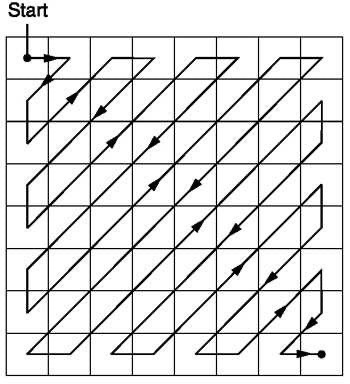

## Question 1
Write a program to validate password according to the follwoing conditions.

Password should have at least one numerical digit(0-9). 

Password's length should be in between 8 to 15 characters. 

Password should have at least one lowercase letter(a-z). 

Password should have at least one uppercase letter(A-Z). 

Password should have at least one special character ( @, #, %, &, !, $, *).

The input is a String of password and the output is boolean value "true" if the password is valid or "false" if the password is invalid.
### For example:
| **Input**     | **Result** |
|:--------------|:-----------|
| I%y0uIsUS | true |
| weakpass | false |
| Password123@ | true |
| Strong#1 | true |
| jas&U2beONE | true |
| X#15 | false |
| Sch00lEI&MyFavPl@ce | false |
| @We2BC0m31@ | true |

## Question 2
A yelling sentence is usually represented buy putting multiple question marks "?" or exclamation marks "!". Your task is to transform the yealling sentence by using only one "?" or "!" for each yelling word.

### For example:
| **Input**     | **Result** |
|:--------------|:-----------|
| What??? | What?|
|Oh my goodness!|Oh my goodness!|
|Don't!!! Touch me!!!!|Don't! Touch me!|
|Why!!! are you cheating??????|Why! are you cheating?|
|It is broken!!!!!|It is broken!|

## Question 3
A palindromic number (also known as a numeral palindrome or a numeric palindrome) is a number (such as 16461) that remains the same when its digits are reversed.

Write a program to count palindromic number from the given integer list.

The input is a size of the list followed by list of integer. The output is the count of palindromic number.

### For example:
| **Input**     | **Result** |
|:--------------|:-----------|
| 5   131 2 33 457 321| 3 |
|10   748273 71932 46123 339889 874476 895548 213071 773774 313875 532235| 1 |

## Question 4
In digital image processing, the Zigzag traversal is a popular method used for scanning the elements of a two-dimensional array (matrix) in a zigzag manner. This pattern is notably utilized in the JPEG compression algorithm to serialize the quantized block of DCT coefficients before further compression. 

Write a Java program that generates a 2D array with given dimensions m x n and fills it with integers in a zigzag order. Then, print the generated 2D array to demonstrate the zigzag pattern.

Input: matrix dimension x and y

Output: a print out of matrix.

The example of this traversal shown below

### For example:
| **Input**     | **Result** |
|:--------------|:-----------|
| 5 5 | 1 2 6 7 15   3 5 8 14 16   4 9 13 17 22   10 12 18 21 23   11 19 20 24 25|

## Question 5
This is a simplified Enigma machine model, though it doesn't capture the full complexity of the historical Enigma machine, offers a basic understanding of how such encryption devices can transform plain text into cipher text. 

The Enigma consists of rators. In this case, it consists of 3 rators. Each rator with a different fixed wiring represented by a string of 26 characters. Each character in a rotor's string represents the output for the corresponding alphabet letter (A-Z) when that letter passes through the rotor. The position of a letter in the string corresponds to a letter of the alphabet (e.g., the first character is the output for 'A', the second for 'B', and so on).

Each input character will be encrypted through each rator. After each letter is encrypted, the first rotor advances by one position. When it completes a full cycle (26 positions), it triggers the next rotor to advance by one position, mimicking the historical Enigma's stepping mechanism. This rotation changes the encryption mapping for each letter, creating a more complex encryption pattern.

For example:

The Enigma consists of 3 rators each contains list of character as follows:

VDMOUCQXPEYJMGHQBZPGXPJLQJ

OIKBDISZUHZPIQPXREBOPBSKCA

COUCWJATHABJGZJQYZKCYZRLPC

The input words are "Hello World". The first input character 'H' is converted to 'B'. Here is the explanation.
The process of encryption starts with the 8th position at the first rator since 'H' is at the 7th position (start counting from 0) of the english alphabet. For the first round each rator start with the index 0 at the first position is at 0, 0, 0  respectively. Then the encryption 3 steps are as followed:

1.  First rotor starting from first letter in the sequence (position 0) 'H' (position 7th of English alphabet) -> 'X' (position 7th of the first rator). Then the rator advances by 1.
2.  Second rotor starting from first letter in the sequence (position 0) 'X' (position 23rd of English alphabet) -> 'K' (position 23rd of the second rator)
3.  Third rotor starting from first letter in the sequence (position 0) 'K' (position 10th of English alphabet) -> 'B' (position 10th of the second rator)
Then the encryption continue to the next character and so on. Keep in mind that, the first rator will be advanced by 1 position for each encryption. When it completes its cycle (26 times), it triggers the next rotor to advance by one position and then reset the its start position to 0.

The first line of input is a plain text used for encrypt. The second to fourth line are sequences of alphabet for each roter. Don't forget to convert the input to all Uppercase before starting encryption process.

The output is the encrypted sentence.

### For example:
| **Input**     | **Result** |
|:--------------|:-----------|
|Hello World   VDMOUCQXPEYJMGHQBZPGXPJLQJ   OIKBDISZUHZPIQPXREBOPBSKCA   COUCWJATHABJGZJQYZKCYZRLPC| BBKCL OBZKH|
|The Fuhrer Adolf Hitler is dead A treacherous group of party leaders has attempted to exploit the situation by attacking our embattled soldiers from the rear to seize power for themselves   HDIRPOJSHGCWEJGWHJNCLORWUO   MSIPXZDJEHPTQUITYRZMTNZXMX   YJLELLWBQKNMVQSGQXXOHSAREP|QKB KORPPQ EBQPH QPELXQ LB QGOL L QGVEVGROREP QEBKO OR LQPRO KPBXOHV EOE BGVVPGORR RO VOROVOO PGQ XKRGQEQRR QR BGBQQOOGO REG VHQQVVHVV KVQVPXHO QGPH GQK VQQP VQ POOQB RRRQO KPR KVXQQQQKPV|
|Amature seek the sun get eaten power stay in shadow   MVVUNVTWYKKZNBYLVAJBHWWMEZ   GNUWTGXDNEXLKHZGXRDQQXFUKG   DREHBTPZELEJAWLFOYBKDSDUJF| EWUTKTU PZWH ZWP OUO ETZ KTJUP EPZOW DPOT TD TUFTTP|
