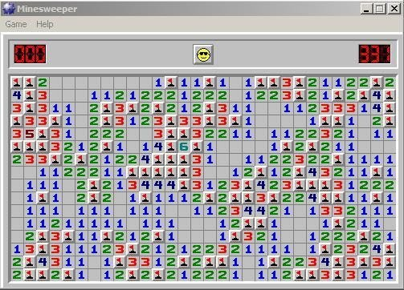
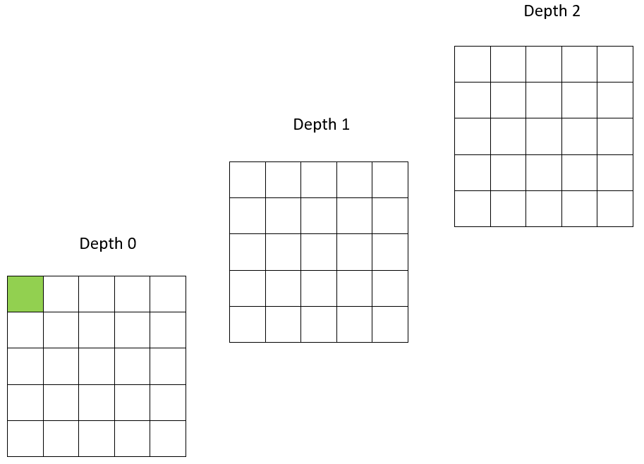
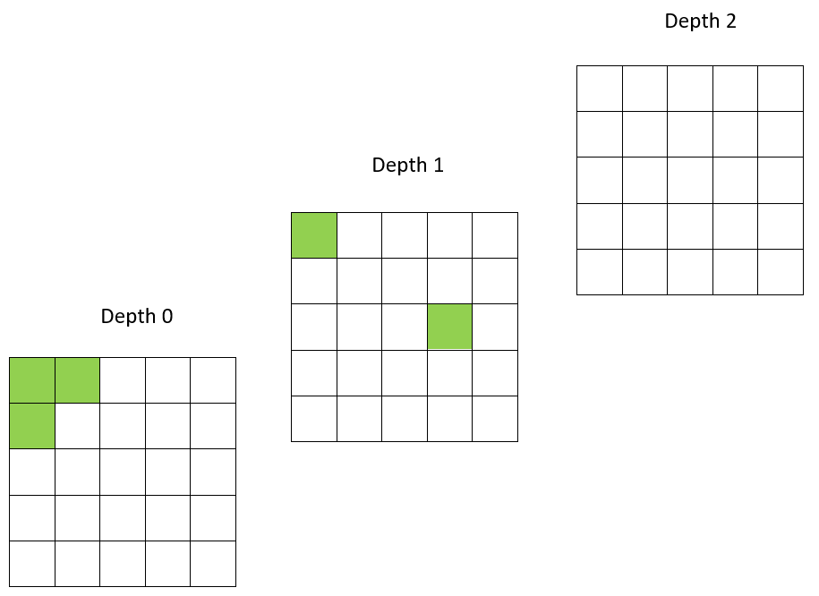
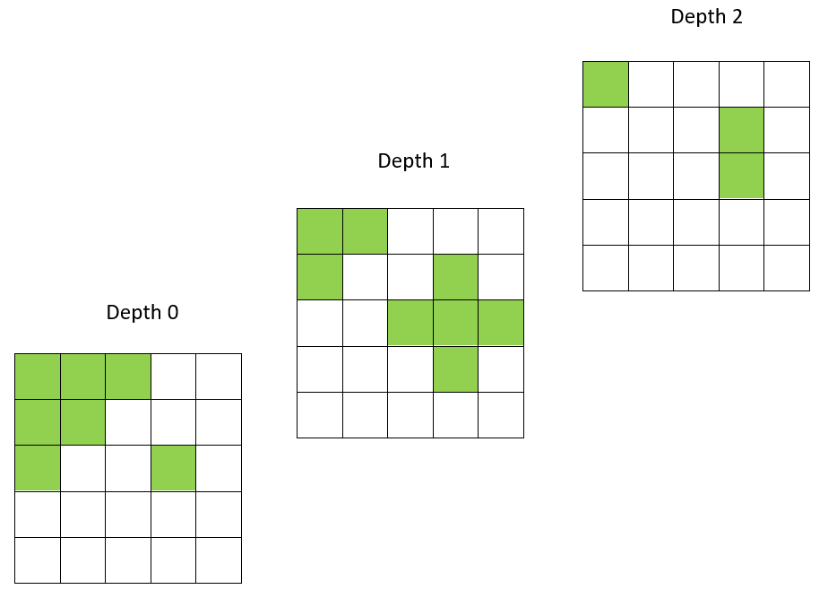

## Question 1
Given an array of integer numbers, remove the largest and smallest numbers, and calculate the average of the remaining numbers.

The input is the size of numbers in the list, followed by list of integer numbers. The output is the average number that rounded to the nearest whole number. (you can use Math.round(double d) ).

### For example:
| **Input**     | **Result** |
|:--------------|:-----------|
| 4  4 5 7 100| 6 |
| 7   5 4 54 4 6 46 56 | 23 |
| 5   10 25 5 15 20| 15 |
| 7   5 4 54 4 6 46 56 | 23 |
| 5   18 16 20 18 3 | 17 |
| 8   4 6 46 466 4666 5 54 544| 187 |

## Question 2
Write a Java program that calculates the sum of the elements in the upper and lower triangular parts of a given N x N square matrix, including the diagonal elements. Your program must separately print the sum of the elements in the upper triangular matrix and the sum of the elements in the lower triangular matrix.

Input:
- The first line contains a single integer N, the size of the matrix.
- The next N lines contain N integers each, representing the elements of the matrix.

Output:

Print two integers on separate lines. The first integer is the sum of the elements in the upper triangular matrix, including the diagonal. The second integer is the sum of the elements in the lower triangular matrix, including the diagonal.
For example, the matrix of size 3 has following list of integer.

1	2	3  
4	5	6  
7	8	9

The upper triangular matrix is:   
1	2	3  
0	5	6  
0	0	9  
Thus, the sum of upper trianular matrix is 1+2+3+5+6+9 = 26

The lower triangular matrix is:  
1	0 0  
4	5	0  
7	8	9  
Thus, the sum of lower trianular matrix is 1+5+9+4+8+7 = 34

### For example:
| **Input**     | **Result** |
|:--------------|:-----------|
| 3   1 2 3   4 5 6   7 8 9| 26   34|
| 5   12 4 5 6 10   7 8 14 6 21   11 2 3 6 16   3 6 7 9 1   8 9 1 2 4| 125   92|
| 5   1 1 1 1 1   1 1 1 1 1   1 1 1 1 1   1 1 1 1 1   1 1 1 1 1| 15   15|
| 10   14 15 13 95 21 4 77 48 40 51   87 98 100 89 10 19 49 55 31 44   1 7 83 33 72 50 64 53 96 81   10 29 35 56 47 8 44 10 88 78   89 100 12 41 22 100 18 96 45 25   60 39 8 77 15 22 8 13 45 16   15 96 77 59 87 59 45 7 66 31   72 89 100 18 79 20 24 9 25 15   63 77 47 23 95 96 58 68 33 18   28 99 19 73 9 67 9 58 31 24| 2419   2731|
## Question 3
Minesweeper is a game providing a board with cells. There are mines randomly distributed.

You are going to create a minesweeper 2D board of 20X20. The input is a 2D array with 30 rows and 30 column and number of mines together with the position that those mines are distributed in row and column. Your task is to assign numbers in the board indicating number of mines nearby. Use -1 to indicate in the cell containing a mine.

### For example:
| **Input**     | **Result** |
|:--------------|:-----------|
| 10   0 0   12 9   8 7   15 17   4 10   19 9   13 11   8 18   5 9   10 13| -1 1 0 0 0 0 0 0 0 0 0 0 0 0 0 0 0 0 0 0   1 1 0 0 0 0 0 0 0 0 0 0 0 0 0 0 0 0 0 0   0 0 0 0 0 0 0 0 0 0 0 0 0 0 0 0 0 0 0 0   0 0 0 0 0 0 0 0 0 1 1 1 0 0 0 0 0 0 0 0   0 0 0 0 0 0 0 0 1 2 -1 1 0 0 0 0 0 0 0 0   0 0 0 0 0 0 0 0 1 -1 2 1 0 0 0 0 0 0 0 0   0 0 0 0 0 0 0 0 1 1 1 0 0 0 0 0 0 0 0 0   0 0 0 0 0 0 1 1 1 0 0 0 0 0 0 0 0 1 1 1   0 0 0 0 0 0 1 -1 1 0 0 0 0 0 0 0 0 1 -1 1   0 0 0 0 0 0 1 1 1 0 0 0 1 1 1 0 0 1 1 1    0 0 0 0 0 0 0 0 0 0 0 0 1 -1 1 0 0 0 0 0   0 0 0 0 0 0 0 0 1 1 1 0 1 1 1 0 0 0 0 0   0 0 0 0 0 0 0 0 1 -1 2 1 1 0 0 0 0 0 0 0   0 0 0 0 0 0 0 0 1 1 2 -1 1 0 0 0 0 0 0 0   0 0 0 0 0 0 0 0 0 0 1 1 1 0 0 0 1 1 1 0   0 0 0 0 0 0 0 0 0 0 0 0 0 0 0 0 1 -1 1 0   0 0 0 0 0 0 0 0 0 0 0 0 0 0 0 0 1 1 1 0   0 0 0 0 0 0 0 0 0 0 0 0 0 0 0 0 0 0 0 0   0 0 0 0 0 0 0 0 1 1 1 0 0 0 0 0 0 0 0 0   0 0 0 0 0 0 0 0 1 -1 1 0 0 0 0 0 0 0 0 0|
|75   4 10   13 19   9 16   3 4   7 13   5 1   9 9   5 7   14 15   5 18   15 16   3 3   4 18   17 12   12 4   2 4   19 0   19 6   17 6   15 3   9 4   18 0   15 12   10 12   14 3   1 19   8 1   1 1   13 18   10 10   12 16   9 16   13 5   19 9   13 10   6 3   3 8   4 2   9 17   2 1   3 11   10 4   19 18   14 13   13 5   18 14   0 14   8 1   9 15   13 9   0 12   10 9   11 2   13 11   7 13   19 1   17 1   18 9   5 11   13 3   17 5   3 13   11 3   18 0   5 11   1 2   12 6   1 10   0 8   1 1   13 19   5 13   1 6   8 16   8 9|1 2 2 1 0 1 1 2 -1 2 1 2 -1 2 -1 1 0 0 1 1   2 -1 -1 2 1 2 -1 2 1 2 -1 2 1 2 1 1 0 0 1 -1   2 -1 4 4 -1 3 1 2 1 2 2 2 2 1 1 0 0 0 1 1   1 2 3 -1 -1 2 0 1 -1 2 2 -1 2 -1 1 0 0 1 1 1   1 2 -1 3 2 1 1 2 2 2 -1 3 4 2 2 0 0 2 -1 2   1 -1 3 2 1 0 1 -1 1 1 2 -1 2 -1 1 0 0 2 -1 2   1 1 2 -1 1 0 1 1 1 0 1 1 3 2 2 0 0 1 1 1   1 1 2 1 1 0 0 0 1 1 1 0 1 -1 1 1 1 1 0 0   1 -1 1 1 1 1 0 0 2 -1 2 0 1 1 2 3 -1 3 1 0   1 1 1 2 -1 2 0 0 3 -1 4 2 1 1 1 -1 -1 -1 1 0   0 1 2 4 -1 2 0 0 2 -1 -1 2 -1 1 1 2 3 2 1 0   0 1 -1 -1 3 3 1 1 1 2 2 2 1 1 0 1 1 1 0 0   0 1 3 4 -1 3 -1 1 1 2 3 2 1 0 0 1 -1 2 2 2   0 0 2 -1 4 -1 2 1 1 -1 -1 -1 2 1 2 2 2 2 -1 -1   0 0 3 -1 4 1 1 0 1 2 3 3 3 -1 2 -1 2 2 2 2   0 0 2 -1 2 0 0 0 0 0 0 1 -1 2 2 2 -1 1 0 0   1 1 2 1 2 2 2 1 0 0 0 2 2 2 0 1 1 1 0 0   2 -1 1 0 1 -1 -1 1 1 1 1 1 -1 2 1 1 0 0 0 0   -1 4 2 0 1 3 3 2 2 -1 2 1 1 2 -1 1 0 1 1 1   -1 -1 1 0 0 1 -1 1 2 -1 2 0 0 1 1 1 0 1 -1 1|
|50   19 9   3 19   17 3   11 19   15 15   3 18   2 8   8 13   12 19   16 6   5 18   17 19   9 6   16 0   19 1   9 17   0 14   11 8   8 9   16 11   12 11   10 3   11 19   14 15   10 14   2 16   10 7   10 16   3 5   1 9   0 0   3 19   11 3   17 13   15 14   10 10   10 7   3 9   2 15   2 4   19 4   10 18   4 15   5 2   7 8   7 19   2 9   3 1   5 10   11 13|-1 1 0 0 0 0 0 0 1 1 1 0 0 1 -1 1 0 0 0 0   1 1 0 1 1 1 0 1 3 -1 2 0 0 1 2 3 2 1 0 0   1 1 1 1 -1 2 1 1 -1 -1 3 0 0 0 1 -1 -1 2 2 2   1 -1 1 1 2 -1 1 1 3 -1 2 0 0 0 2 3 3 2 -1 -1   1 2 2 1 1 1 1 0 1 2 2 1 0 0 1 -1 1 2 3 3   0 1 -1 1 0 0 0 0 0 1 -1 1 0 0 1 1 1 1 -1 1   0 1 1 1 0 0 0 1 1 2 1 1 0 0 0 0 0 1 2 2   0 0 0 0 0 0 0 1 -1 2 1 0 1 1 1 0 0 0 1 -1   0 0 0 0 0 1 1 2 2 -1 1 0 1 -1 1 0 1 1 2 1   0 0 1 1 1 1 -1 2 2 2 2 1 1 2 2 2 2 -1 2 1   0 0 2 -1 2 1 2 -1 2 2 -1 1 1 2 -1 2 -1 3 -1 2   0 0 2 -1 2 0 1 2 -1 2 2 2 2 -1 2 2 1 2 3 -1   0 0 1 1 1 0 0 1 1 1 1 -1 2 1 1 0 0 0 2 -1   0 0 0 0 0 0 0 0 0 0 1 1 1 0 1 1 1 0 1 1   0 0 0 0 0 0 0 0 0 0 0 0 0 1 3 -1 2 0 0 0   1 1 0 0 0 1 1 1 0 0 1 1 1 1 -1 -1 2 0 0 0   -1 1 1 1 1 1 -1 1 0 0 1 -1 2 2 3 2 1 0 1 1   1 1 1 -1 1 1 1 1 0 0 1 1 2 -1 1 0 0 0 1 -1   1 1 2 2 2 1 0 0 1 1 1 0 1 1 1 0 0 0 1 1   1 -1 1 1 -1 1 0 0 1 -1 1 0 0 0 0 0 0 0 0 0|

## Question 4
Write a java program to print the steps of 2D array traversal in a spiral form.

For example,

Given the 4 x 4 array, the traversal form is:

1	2	3	4  
12	13	14	5  
11	16	15	6  
10	9	8	7

### For example:
| **Input**     | **Result** |
|:--------------|:-----------|
| 4 4 |1 2 3 4    12 13 14 5   11 16 15 6   10 9 8 7|
| 5 4 |1 2 3 4   14 15 16 5   13 20 17 6   12 19 18 7   11 10 9 8|
| 6 4 |1 2 3 4   16 17 18 5   15 24 19 6   14 23 20 7   13 22 21 8   12 11 10 9|
| 5 5 |1 2 3 4 5   16 17 18 19 6   15 24 25 20 7   14 23 22 21 8   13 12 11 10 9|
| 5 8 |1 2 3 4 5 6 7 8   22 23 24 25 26 27 28 9   21 36 37 38 39 40 29 10   20 35 34 33 32 31 30 11   19 18 17 16 15 14 13 12|

## Question 5
The gardener is cultivating a 3D grass field by planting a block of grass each day. For each day, the grass exhibits continuous growth, expanding into neighboring cells across six dimensions: up, down, left, right, front, and back. The gardener intends to continue planting for several days. On the final day of planting, write a program to determine the total number of cells occupied by the grass.

The input consitst of 3 parts:

1. size of the 3D field (row, column, depth)

2. number of days

3. a position of cell that the gardener plant a block of grass in each day

The output is the total number of cells occupied by the grass.

The first day of planting, the 3D field is visualized as follow:

The second day of planting, the 3D field is visualized as follow:

The third day of planting, the 3D field is visualized as follow:

From the example, after planting for 3 days, the total number of occupied cell is 18.

### For example:
| **Input**     | **Result** |
|:--------------|:-----------|
| 5 5 3   3   0 0 0   2 3 1   1 3 2 | 18|
| 3 3 3   2   0 0 0   2 2 2| 5 |
| 5 4 3   3   3 0 2   4 1 1   2 2 2| 17 |
| 4 4 5   4   1 2 3   2 2 2   3 1 4   0 0 1| 53 |
