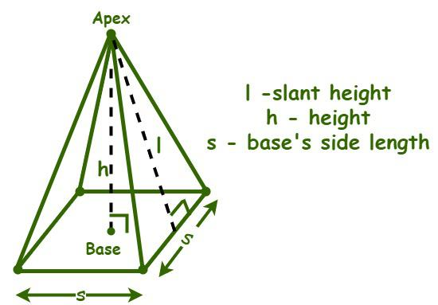

## Question 1
Given 2 input integers with 3 digits. Reverse numbers and add them.

### For example:
| **Input**     | **Result** |
|:--------------|:-----------|
|321 782|410|
|128 369|1784|
|647 435|1280|
|777 666|1443|
|846 813|966|

## Question 2
Write a program to return if the characters of the input String is ordered according to lexical order. The result return boolean value true if the String is ordered and false if the String is not ordered.
### For example:
| **Input**     | **Result** |
|:--------------|:-----------|
|xyzz|true|
|hello|false|
|glory|true|
|program|false|
|abbott|true|

## Question 3
Write a class representing a square based pyramid as illustrated below.



|Pyramid|
|:------|
|- height: double <br> - slantheight: double <br> - basewidth: double|
|+ Pyramid(height:double, slantheight:double, basewidth:double) <br> + getVolumn(): double <br> + getArea(): double|

The Pyramid class contains three main atrributes. They are height, slant height and base width as for the base's side length. The constructor Pyramid will initiate the object with the input values.

The getVolumn() method is used to calculate volumn of a pyramid which is returned as double.
The fomula for calculating volumn of pyramid is: base area × height / 3. In this case the base area is the square area which can be obtained by: basewidth × basewidth.

Similary, the method getAreay() is used to calculate area of pyramid's surface which is returned as double.
The formular for calculating area of pyramid's surface is: base area + sum of the areas of its lateral faces. Each lateral face area can be obtained by: (basewidth × slantheight) / 2. 

Noted that the driver class is provided in the preloaded answer box. Do not change the driver class otherwise your result may be incorrect.
### For example:
| **Input**     | **Result** |
|:--------------|:-----------|
|12 13 10|Volumn: 400.0<br>Surface area: 360.0|
|36 39 30|Volumn: 10800.0<br>Surface area: 3240.0|
|19.615 21 15|Volumn: 1471.125<br>Surface area: 855.0|
|24 25 14|Volumn: 1568.0<br>Surface area: 896.0|
|40 41 18|Volumn: 4320.0<br>Surface area: 1800.0|
```
import java.util.Scanner;

public class PyramidDriver {

  public static void main(String[] args) {
    Scanner sc = new Scanner(System.in);
    double height = sc.nextDouble();
    double slantheight = sc.nextDouble();
    double basewidth = sc.nextDouble();
    Pyramid p = new Pyramid(height, slantheight, basewidth);
    System.out.println("Volumn: " + p.getVolumn());
    System.out.println("Surface area: " + p.getArea());
  }
}

class Pyramid {
  //put your code here
}
```

## Question 4
Have you ever play Harvest Moon? In the game, you can plant some crops to harvest for selling. Each time you sow a bag of seeds, seeds are spreaded into 9 cells in the field as shown below.


Giving 20 X 20 crop field for planting, each day you sow only one bag of seeds. There are 3 types of crops that you can grow including: tomato, leek and strawberry. Each of them has different period of harvest:
Tomato takes 5 days to fully grows (start counting next day after it is sowed).
Leek takes 3 days to fully grows (start counting next day after it is sowed).
Strawberry takes 7 days to fully grows (start counting next day after it is sowed).

Your task is to write a program to count number of harvests for each type of crop after 10 days. The input consist of 2 parts:
1. number of sow days.
2. type of sow seed (i.e., 1 = tomato, 2 = leek, 3 = strawberry) then followed by sow position of the cell in row and colum (the the seed will be spreaded to all directions from the sow position i.e., top, top-left, top-right, left, right, bottom, bottom-left, bottom-right).

PS. If there already exists a crop at the spreaded cell, the cell will be replaced by the newly sowed seed.
### For example:
| **Input**     | **Result** |
|:--------------|:-----------|
|5 <br> 1 3 3 <br> 1 12 8 <br> 3 3 12 <br> 2 15 15 <br> 2 7 10 | Tomato: 18 <br> Leek: 18 <br> Strawberry: 9 |
|5 <br> 1 3 3 <br> 1 12 8 <br> 2 15 15 <br> 2 7 10 <br> 3 3 12 <br> |Tomato: 18 <br> Leek: 18 <br> Strawberry: 0 |
|7 <br> 1 3 3 <br> 1 12 8 <br> 3 7 17 <br> 3 3 12 <br> 2 15 15 <br> 2 7 10 <br> 2 16 4 | Tomato: 18 <br> Leek: 27 <br> Strawberry: 9|
|7 <br> 1 3 3 <br> 3 7 17 <br> 3 3 12 <br> 1 12 8 <br> 2 15 15 <br> 2 7 10 <br> 2 16 4 | Tomato: 18 <br> Leek: 27 <br> Strawberry: 18 |
|7 <br> 1 2 2 <br> 3 3 12 <br> 1 5 18 <br> 3 7 17 <br> 2 15 15 <br> 1 18 13 <br> 3 18 2 | Tomato: 16 <br> Leek: 9 <br> Strawberry: 9|


## Question 5
You will receive an array of 20 integers and you must identify all pairs of distinct prime numbers and calculate the distance between each pair. The distance is defined as the absolute difference between the two prime numbers. Your task is to find and print the minimum distance among all possible pairs of prime numbers found in the array. If there is no prime number pair in the list, print "No prime pair found"

Note: The input number shall not exceed 100

### For example:
| **Input**     | **Result** |
|:--------------|:-----------|
|29 1 17 5 12 19 70 80 90 100 15 25 35 45 55 65 75 85 95 15|2|
|10 20 30 40 50 60 70 80 90 100 15 25 35 45 55 65 75 85 95 15|No prime pair found|
|99 2 83 63 95 80 90 65 39 55 75 91 21 47 54 67 78 36 10 4|16|
|2 39 46 75 56 31 48 36 35 55 29 50 13 66 76 40 67 85 81 77|2|
|42 12 22 61 81 16 10 47 32 98 88 54 15 35 83 100 92 43 55 45|4|
|80 36 74 60 22 10 8 68 65 88 52 95 78 95 18 48 81 34 86 19|No prime pair found|
