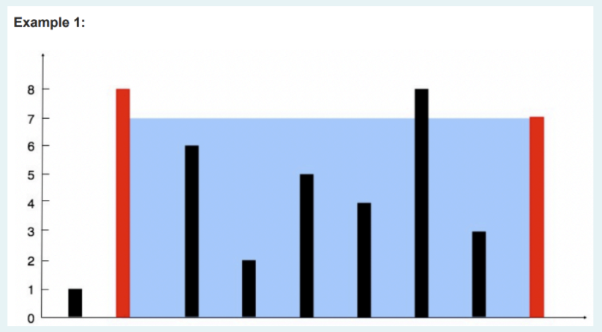
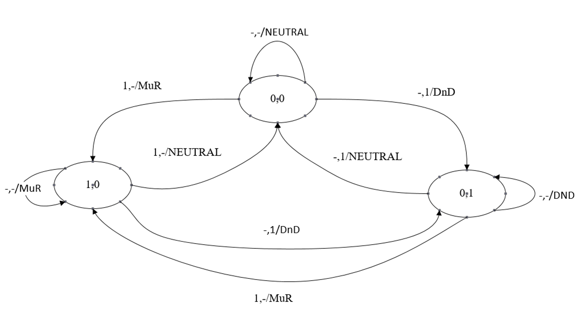
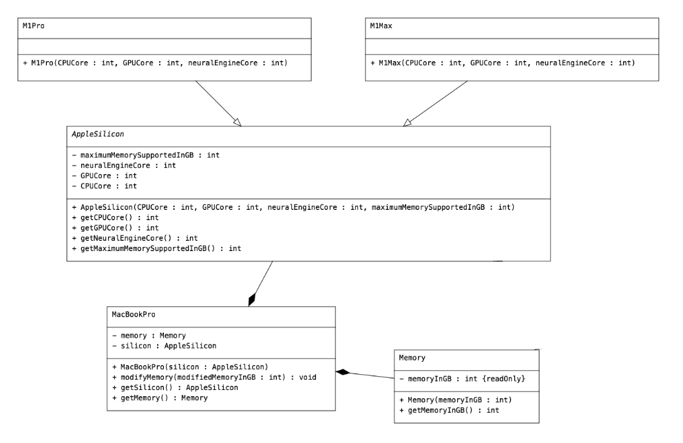

## Question 1

A soldier wants to buy w bananas in the shop. He has to pay k dollars for the first banana, 2k dollars for the second one, and so on (in other words, he has to pay i \* k dollars for the i-th banana).
He has n dollars. How much (in dollar) does he have to borrow from his friend to buy w bananas?

Input
The first line contains three positive integers k, n, w (1 ≤ k, w ≤ 1000, 0 ≤ n ≤ 109), the cost of the first banana, initial number of dollars the soldier has, and number of bananas he wants.

Output
Output one integer — the amount of dollars that the soldier must borrow from his friend. If he doesn't have to borrow money, output 0.

### For example:

| **Input**           | **Result** |
| :------------------ | :--------- |
| 3 17 4              | 13         |
| 3 35 4              | 0          |
| 1000 0 1000         | 500500000  |
| 1000 500500001 1000 | 0          |
| 432 10000 241       | 12587552   |
| 634 87973 214       | 14497197   |
| 1000 500499999 1000 | 1          |
| 47 2367 20          | 7503       |

## Question 2

Write a program to count number having unique digits (no digit repeated).

The input is a size of the list and followed by list of numbers.

The output is a number having unique digits.

### For example:

| **Input** | **Result** |
| :------------------ | :--------- |
|5<br>1081 45442 99575 45901 31289|2|
|10<br>4275 1639 38443 24013 24858 97459 75648 39720 5004 71286|6|
|100 <br> 73195 67569 24173 8655 23668 40359 77944 47775 56071 91888 86748 65277 84356 93225 53631 36885 23917 89623 19903 95797 13183 49144 98529 82820 95209 37344 77935 8679 8737 83059 57703 15154 38675 40553 95591 6193 97870 31614 50219 8433 88082 79081 57678 1431 53117 20636 6183 38015 88012 16064 7539 20815 72790 12500 77030 96567 62513 44776 19016 53910 95556 5393 282 97533 95911 13617 46041 73522 92422 81325 61802 32973 81449 95236 52208 49709 98953 74873 27195 31378 41670 3471 90332 51325 50503 95900 71085 86848 75273 62619 8749 58576 52834 5987 5479 50337 63346 4453 15779 39204|31|
|20 <br> 87779 34799 51507 26978 23411 86346 89072 57198 45892 22662 28983 13378 47283 51020 78385 48168 48423 3986 34502 57971|7|
|50 <br> 15585 93605 81456 94994 466 62705 91449 20716 58631 22221 94536 96804 21523 74989 2401 79432 14669 81474 57039 70025 60623 84265 18797 76188 70732 48160 18695 10906 79333 69706 29779 58211 84911 74609 38899 71291 49385 88979 6646 71342 23278 91224 88841 9734 41031 73721 82243 14847 1739 48403|18|


## Question 3

You are given an integer array height of length n. There are n vertical lines with given height for each line. Each line is arranged 1 unit away from its neighbor. Any pair of line can form a water container. Find the maximum amount of water that can contain between two lines as shown as example below. The input is the number of lines in the list followed by list of heights for each line. The output is maximum amount of water that can be contained.



### For example:
| **Input**           | **Result** |
| :------------------ | :--------- |
|9 <br> 1 8 6 2 5 4 8 3 7| 49 |
|5<br>5 7 3 2 1|6|
|7<br>2 5 9 8 9 3 2|18|
|10<br>6 19 9 5 14 20 2 4 5 20|152|
|20<br>1 2 3 4 5 6 7 8 9 10 11 12 13 14 15 16 17 18 19 20|100|

## Question 4

Mr. Ukrit is a new manager of Continental Hotel, Bangkok. He has to be prepared to welcome the most famous assassin of the continental ground, Mr. John Wick. He develops IoT light switches showing his customer need to inform butlers. These light switches are toggle switches. One of switches has a light signal of “Make Up Room” (MuR). Another one has a light signal of “Do not Disturb” (DnD). These two switches can be both “off”, but either one of them can be “on” at a time. There are two states of signal which are 0 and 1 representing "on" and "off" respectively.

The input consists of two lines. The first line is a pair of current state representing the on/off status of each switch. The second line is the switch input clicking of MuR switch and DnD switch, each represented by “1” or “-” where "1" represents clicking and "-" represents not clicking. The output is the status of the next state which are either "NEUTRAL" if both switch off, "MuR" if the MuR switch is on, or "DnD" if the DnD switch is on. Examples are provided in the table below.

|Current State<br>(first line of input)|Clicking<br>(second line of input)|Next State<br>(output)|
|:-------------:|:-----------:|:-----------:|
| 0 0 | - 1 | DnD |
| 0 1 | 1 - | MuR |

With these conditions, it can be depicted by using the Finite State Machine diagram shown below.



### For example:

| **Input**    | **Result** |
| :----------- | :--------- |
| 0 0 <br> - - | NEUTRAL    |
| 0 0 <br> - 1 | DnD        |
| 0 0 <br> 1 - | MuR        |
| 1 0 <br> - 1 | DnD        |
| 0 1 <br> - - | DnD        |
| 0 1 <br> 1 - | MuR        |

## Question 5

In October 2021, Apple released redesigned MacBook Pro 14 inches and 16 inches. They also announce the new Apple Silicon, M1 Pro, and M1 Max processor for two new MacBook Pro. The only major difference between those processors is the maximum memory support. On M1 Pro, it only supports memory up to 32GB and 64GB on M1 Max. By default, each MacBook Pro has 16GB of memory, but the user can change the amount of memory using the modifyMemory function. There is no limitation of CPUCore, GPUCore, and neuralEngineCore on both of the processors. Implement the Java classes according to the UML below.



Note that the modifyMemory function in MacBookPro class will receive an integer parameter which represents the amount of memory that the user wants to change in GB. If it is larger than the maximum memory that the processor can support, print the message `ERROR` and change nothing.

Noted that, the driver class and some layouts of each class are already provided in the preload answer. Please do not modify the driver class since the output may be incorrect.

```
public class TestDriver {

    public static void main(String[] args) {
        // DO NOT MODIFY Main class and main function
        M1Pro m1Pro = new M1Pro(8, 14, 16);
        M1Max m1Max = new M1Max(10, 24, 16);

        MacBookPro mbp1 = new MacBookPro(m1Pro);
        MacBookPro mbp2 = new MacBookPro(m1Max);
        System.out.println("-----------MacBook Pro 1-----------");
        System.out.println("MBP1, Memory: " + mbp1.getMemory().getMemoryInGB() + " GB");
        System.out.println("MBP1, CPU: " + mbp1.getSilicon().getCPUCore() + " Cores");
        System.out.println("MBP1, GPU: " + mbp1.getSilicon().getGPUCore() + " Cores");
        System.out.println("MBP1, NeuralEngine: " + mbp1.getSilicon().getNeuralEngineCore() + " Cores");
        System.out.println("MBP1, MaxMemory: " + mbp1.getSilicon().getMaximumMemorySupportedInGB() + " GB");
        mbp1.modifyMemory(32);
        System.out.println("MBP1, Memory: " + mbp1.getMemory().getMemoryInGB() + " GB");
        mbp1.modifyMemory(64);
        System.out.println("MBP1, Memory: " + mbp1.getMemory().getMemoryInGB() + " GB");

        System.out.println("-----------MacBook Pro 2-----------");
        System.out.println("MBP2, Memory: " + mbp2.getMemory().getMemoryInGB() + " GB");
        System.out.println("MBP2, CPU: " + mbp2.getSilicon().getCPUCore() + " Cores");
        System.out.println("MBP2, GPU: " + mbp2.getSilicon().getGPUCore() + " Cores");
        System.out.println("MBP2, NeuralEngine: " + mbp2.getSilicon().getNeuralEngineCore() + " Cores");
        System.out.println("MBP2, MaxMemory: " + mbp2.getSilicon().getMaximumMemorySupportedInGB() + " GB");
        mbp2.modifyMemory(64);
        System.out.println("MBP2, Memory: " + mbp2.getMemory().getMemoryInGB() + " GB");
    }
}

abstract class AppleSilicon {

}

class M1Pro extends AppleSilicon {

}

class M1Max extends AppleSilicon {

}

class Memory {

}

class MacBookPro {

}
```

### For example:

| **Expected** |
| :----------- |
|-----------MacBook Pro 1----------- <br> MBP1, Memory: 16 GB<br>MBP1, CPU: 8 Cores<br>MBP1, GPU: 14 Cores<br>MBP1, NeuralEngine: 16 Cores<br>MBP1, MaxMemory: 32 GB<br>MBP1, Memory: 32 GB<br>ERROR<br>MBP1, Memory: 32 GB<br>-----------MacBook Pro 2-----------<br>MBP2, Memory: 16 GB<br>MBP2, CPU: 10 Cores<br>MBP2, GPU: 24 Cores<br>MBP2, NeuralEngine: 16 Cores<br>MBP2, MaxMemory: 64 GB<br>MBP2, Memory: 64 GB|
