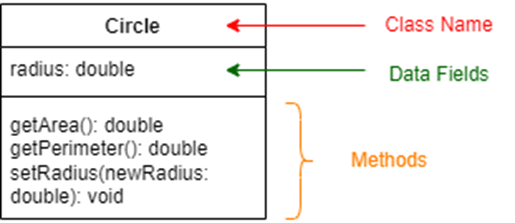

# CircleDriver



Implement a Circle class that models a circle calculator and demonstrate its functionality by creating an instance of the class, setting the radius and displaying the area and perimeter. The class should meet the following specifications:

Attribute (or Data Fields)
A single attribute “radius” of type “double” representing the radius of the circle.
Methods
double getArea() that calculates and returns the area of the circle.
double getPerimeter() that calculates and returns the perimeter (circumference) of the circle.
double setRadius(double newRadius) that updates the radius of the circle with the given value.

Additionally, the program includes a CircleDriver class, which is a driver class. DO NOT modify the CircleDriver class, as doing so may result in failure of your code. Your task is to write the code for the Circle class, which must be the only public class in this program.

## For example

| **Input**     | **Result** |
|:--------------|:-----------|
| 1.0 | Radius: 1.0 <br> Circle Area: 3.141592653589793 <br> Circle Perimeter: 6.283185307179586 |

```java
public class CircleDriver {
    public static void main(String[] args) {
        Scanner sc = new Scanner(System.in);
        Circle c = new Circle();
        double radius = sc.nextDouble();
        c.setRadius(radius);
        System.out.println("Radius: " + c.getRadius());
        System.out.println("Circle Area: " + c.getArea());
        System.out.println("Circle Perimeter: " + c.getPerimeter());
    }
}

class Circle {
    // Write your code here
    
}
```
