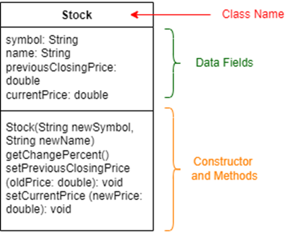

# StockDriver



Write a Java class named Stock to represent a rectangle. The class contains:

Attributes (or Data Fields)
A string attribute named “symbol” for the stock’s symbol.
A string attribute named “name” for the stock’s name.
A double data field name “previousClosingPrice” that stores the stock price for the previous day.
A double data field name “currentPrice” that stores the stock price for the current time.
Methods
double getChangePercent() that returns the percentage changed from previousClosingPrice to currentPrice.
double setPreviousClosingPrice(double oldPrice) that updates the previous closing price with specified value.
double setCurrentPrice(double newPrice) that updates the current price with the specified value.

Additionally, the program includes a StockDriver class, which is a driver class. DO NOT modify the StockDriver class, as doing so may result in failure of your code. Your task is to write the code for the Stock class, which must be the only public class in this program.

## For example

| **Input**     | **Result** |
|:--------------|:-----------|
| ex | ex |

```java
public class StockDriver {
    public static void main(String[] args) {
        Scanner sc = new Scanner(System.in);
        String symbol = sc.nextLine();
        String name = sc.nextLine();
        Stock s = new Stock(symbol, name);
        double previousPrice = sc.nextDouble();
        double currentPrice = sc.nextDouble();
        s.setPreviousClosingPrice(previousPrice);
        s.setCurrentPrice(currentPrice);
        System.out.println("Stock name: " + s.name);
        System.out.println("Stock symbol: " + s.symbol);
        System.out.printf("Price-change percentage: %.2f%%", s.getChangePercent());
    }
}

class Stock {
    // Write your code here
    
    // Constructor - DO NOT CHANGE HERE
    Stock(String newSymbol, String newName){
        symbol = newSymbol;
        name = newName;
    }
    
    // Write your code here
    
}
```
