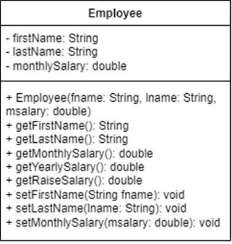

# EmployeeDriver

Create a class called Employee to represent an employee’s yearly salary calculation. The class should include the following:

* Attributes (or Data Fields)
  * A private string attribute named "firstName" for the employee first name.
  * A private string attribute named "lastName" for the employee last name.
  * A private double attribute named "monthlySalary" that stores the employee’s monthly salary.
* Constructor
  * Provide a constructor that initializes the three instance variables: firstName, lastName, and monthlySalary.
* Methods
  * Provide a set and get methods for each instance variable.
  * Constraint: If the monthlySalary is not positive, do not set its value.

Furthermore, write a driver class named EmployeeDriver that demonstrates class Employee’s capabilities:

* Display each employee’s yearly salary.
* Give each employee a 10% raise.
* Display each Employee’s yearly salary again after the raise.

## For example

| **Input**     | **Result** |
|:--------------|:-----------|
| Thanatat   Wongabut   20000 | Employee: Thanatat Wongabut   Yearly salary: 240000.00   Yearly salary after raise: 264000.00 |
| Kristina   Obrien   120000 | Employee: Kristina Obrien   Yearly salary: 1440000.00   Yearly salary after raise: 1584000.00 |
| Lincoln   Yang   45000 | Employee: Lincoln Yang   Yearly salary: 540000.00   Yearly salary after raise: 594000.00 |
| Raihan   Gill   -35000 | Employee: Raihan Gill   Yearly salary: 0.00   Yearly salary after raise: 0.00 |
| Sarun   Wilkinson   27845.75 | Employee: Sarun Wilkinson   Yearly salary: 334149.00   Yearly salary after raise: 367563.90 |
