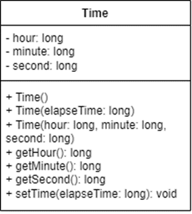

# TimeDriver

Create a class called Time to represent time calculations. The class should include the following:

* Attributes (or Data Fields)
  * Private long attributes named "hour", "minute", and "second" that represent a time.
* Constructors
  * A no-argument constructor that creates a Time object for the current time. (The values of the data fields will represent the current time.)
  * A constructor that constructs a Time object with a specified elapsed time since midnight, January 1, 1970, in milliseconds. (The values of the data fields will represent this time.)
  * A constructor that constructs a Time object with the specified hour, minute, and second.
* Methods
  * Three getter methods for the data fields hour, minute, and second respectively.
  * A method named setTime(long elapseTime) that sets a new time for the object using the elapsed time. For example, if the elapsed time is 555550000 milliseconds, the hour is 10, the minute is 19, and the second is 10.

Write a driver class named TimeDriver that creates Time objects and displays their hour, minute, and second in the format hour:minute:second.

## For example

| **Input**     | **Result** |
|:--------------|:-----------|
| 555550000 | 10:19:10 |
| 86400000 | 0:0:0 |
| 5000000000 | 20:53:20 |
| 1234567890 | 6:56:7 |
| 0 | 0:0:0 |
