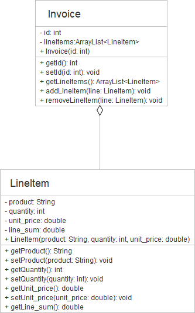

## Question 1
Write a program to add digit from a given 9-digits number according to the following conditions:

1. If the middle digit is an odd number, add all digits which are in the odd position.

2. If the middle digit is an even number, add all digits which are in the even position.

Note that the position starts at 0 index (even number).

### For example:
| **Input** | **Result** |
|:--------- |:-----------|
|214532369|14|
|938524187|27|
|298103857|25|
|111242799|22|


## Question 2  
Your task is to encrypt the message with a certain number of words according to the following conditions.

1. If the word is in the even position (starting counting from 0), covert to UPPERCASE otherwise covert to lowercase.
2. Reverse characters in each word.

The input is a number of words in a sentence and a sentence itself. The output is an encrypted sentence.

### For example:
| **Input** | **Result** |
|:--------- |:-----------|
|15<br>Java applications are typically compiled to bytecode that can run on any Java virtual machine|AVAJ snoitacilppa ERA yllacipyt DELIPMOC ot EDOCETYB taht NAC nur NO yna AVAJ lautriv ENIHCAM|
|9<br>Little Red Riding Hood decided to wear orange today|ELTTIL der GNIDIR dooh DEDICED ot RAEW egnaro YADOT|
|16<br>She still thought it was okay to put the toilet paper roll under rather than over|EHS llits THGUOHT ti SAW yako OT tup EHT teliot REPAP llor REDNU rehtar NAHT revo|
|9<br>Toddlers feeding raccoons surprised even the seasoned park ranger|SRELDDOT gnideef SNOOCCAR desirprus NEVE eht DENOSAES krap REGNAR|
|19<br>He went back to the video to see what had been recorded and was shocked at what he saw|EH tnew KCAB ot EHT oediv OT ees TAHW dah NEEB dedrocer DNA saw DEKCOHS ta TAHW eh WAS|

## Question 3  
Write a program to swap the adjacent elements as the following conditions:

1. If the size of the given element list is even, then swap each pair of adjacent element.

2. If the size of the given element list is odd, then swap each pair of adjacent element except the last element.

For example, the input list is: 1 2 3 0 then the output is: 2 1 0 3.

The input consists of size of elements and list of elements.

### For example:
| **Input** | **Result** |
|:--------- |:-----------|
|5<br>5 1 4 2 8|1 5 2 4 8|
|10<br>71 35 64 15 13 58 96 9 72 3|35 71 15 64 58 13 9 96 3 72|
|15<br>36 22 64 39 74 35 57 81 37 25 30 71 42 93 12|22 36 39 64 35 74 81 57 25 37 71 30 93 42 12|
|4<br>1 2 3 0|2 1 0 3|

## Question 4  
Giving a grid (two-dimensional array) containing lights, write a program to toggle the light according to the following conditions:

1. User number 0 and 1 to represent light off and on respectively.

2. At the selected position, the light will be toggled. The light in the adjacent positions are also toggled. These include the above, the below, the left and the right.

For example, giving the grid below if the selected toggle position is at row 1 and column 2, the toggle is shown as below.


The input has three lines. The first line indicates a size of array (i.e., rows and columns which are at least 3 rows/columns). The second line contains a list of 0 and 1 values in an array. The third line contains the toggled positions (i.e., row and column).  The output is the resulted array after toggling the input array according to the toggle positions.


### For example:
| **Input** | **Result** |
|:--------- |:-----------|
|5 5 <br> 1 0 1 1 1 0 0 0 1 0 1 0 0 0 0 1 1 1 1 1 0 0 0 0 0 <br> 3 2|1 0 1 1 1 0 0 0 1 0 1 0 1 0 0 1 0 0 0 1 0 0 1 0 0|
|3 4 <br> 0 0 1 1 1 0 1 1 1 0 0 0 <br> 1 2|0 0 0 1 1 1 0 0 1 0 1 0|
|5 3 <br> 0 0 0 0 0 1 1 1 0 1 0 1 0 0 0 <br> 1 1|0 1 0 1 1 0 1 0 0 1 0 1 0 0 0|

## Question 5  
Giving the UML Class Diagram as below. Write a program according to the given class diagram.



An invoice consists of many line items which indicate product, quantity and price per unit. The Invoice class holds line item in the ArrayList. It can add a line item by using addLineItem(LineItem line) method. This method will add a line item into the ArrayList. The logic of adding a line item is to check if the line item is already existed in the ArrayList. If a line item already exists, it will print "This line item already exists." Otherwise, the line item is added to ArrayList. Similarly, to remove a line item, the removeLineItem(LineItem line) method will check if the ArrayList contains the line item. If it contains the line item, it will remove the line item directly. Otherwise, it will print "This line item does not exist.".

The LineItem class represents line item. Each line item contains product name, quantity and price per unit. The attribute line_sum is the total price of the line item which is calculated from quantity * unit_price. Furthermore, the method setQuantity(int quantity) and setUnit_price(double unit_price) will also update line_sum whenever they are called.

Noted that the driver class is provided in the preloaded answer box. Please do not modify the driver class.

| **Expected** |
|:--------- |
|This line item does not exist.<br>This line item already exists.<br>----------- Invoice 1 Info -----------<br>Lays 5 20.0<br>KitKat 2 15.0<br>CocaCola 2 17.5<br>Total 165.0<br>----------- Invoice 2 Info -----------<br>UHT 3 8.0<br>Milo-Icecream 2 10.0<br>Nestle 2 7.5<br>Total 59.0|
```
public class Tester {

  public static void main(String args[]) {
    Tester t = new Tester();
    Invoice in1 = new Invoice(001);
    LineItem l1 = new LineItem("Lays", 5, 20);
    LineItem l2 = new LineItem("KitKat", 2, 15);
    LineItem l3 = new LineItem("CocaCola", 2, 17.5);
    in1.addLineItem(l1);
    in1.removeLineItem(l3);
    in1.addLineItem(l2);
    in1.addLineItem(l3);
    in1.addLineItem(l1);
    System.out.println(
      "----------- Invoice " + in1.getId() + " Info -----------"
    );
    t.printLineItem(in1);
    System.out.println("Total " + t.getTotal(in1));

    Invoice in2 = new Invoice(003);
    in2.setId(002);
    LineItem l4 = new LineItem("UHT", 6, 8);
    LineItem l5 = new LineItem("Milo-Icecream", 2, 15);
    LineItem l6 = new LineItem("7-select", 2, 7.5);
    l4.setQuantity(3);
    l5.setUnit_price(10);
    l6.setProduct("Nestle");
    in2.addLineItem(l4);
    in2.addLineItem(l5);
    in2.addLineItem(l6);
    System.out.println(
      "----------- Invoice " + in2.getId() + " Info -----------"
    );
    t.printLineItem(in2);
    System.out.println("Total " + t.getTotal(in2));
  }

  public double getTotal(Invoice in) {
    double total = 0;
    for (int i = 0; i < in.getLineItems().size(); i++) {
      total += in.getLineItems().get(i).getLine_sum();
    }
    return total;
  }

  public void printLineItem(Invoice in) {
    for (int i = 0; i < in.getLineItems().size(); i++) {
      LineItem l = in.getLineItems().get(i);
      System.out.println(
        l.getProduct() + " " + l.getQuantity() + " " + l.getUnit_price()
      );
    }
  }
}
```
