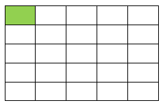
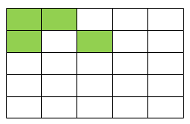
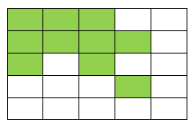
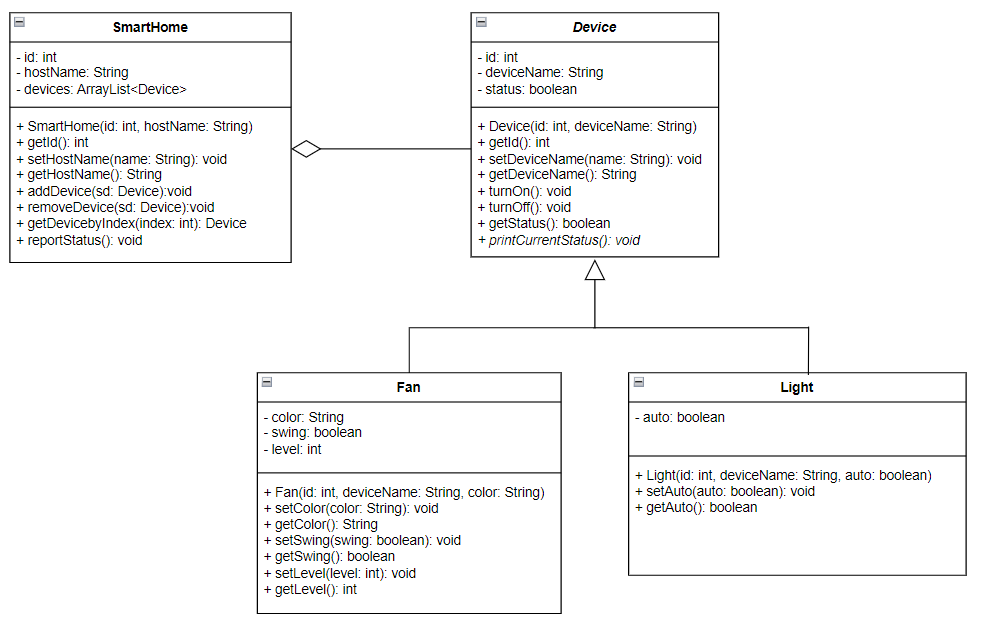

## Question 1
Write a program to output the century from the given year.

The input is the year, and the output is century with its suffix.

### For example:
| **Input** | **Result** |
|:--------- |:-----------|
|1500|15th|
|1535|16th|
|2021|21st|
|2245|23rd|
|2200|22nd|
|1400|14th|
|1985|20th|
|3021|31st|
|3215|33rd|
|2105|22nd|
|1201|13th|

## Question 2  
Given an array of n positive integers. The task is to swap every element with the current position + ith element.

The input consist of two parts. The first part is the i , the second part is the size of the element in the given array followed by all elements in the array.

### For example:
| **Input** | **Result** |
|:--------- |:-----------|
|2 <br> 5 <br> 1 2 3 4 5|3 4 5 2 1|
|2 <br> 3 <br> 1 2 3|3 2 1|
|4 <br> 50 <br> 95 61 85 24 59 62 50 75 93 69 11 76 41 66 97 82 70 14 79 63 72 30 92 29 40 84 46 60 56 58 36 4 53 12 31 47 57 39 43 21 89 65 88 87 68 35 38 13 52 45|59 62 50 75 93 69 11 76 41 66 97 82 70 14 79 63 72 30 92 29 40 84 46 60 56 58 36 4 53 12 31 47 57 39 43 21 89 65 88 87 68 35 38 13 52 45 85 24 95 61|
|7 <br> 100 <br> 832 904 881 488 995 121 466 262 987 524 418 46 309 367 816 407 500 331 419 327 934 294 848 51 265 431 446 813 733 360 597 301 236 34 125 938 719 806 948 448 23 144 435 68 225 686 32 461 335 2 268 640 44 42 372 774 979 750 156 945 433 897 544 376 577 888 52 356 96 235 670 276 194 858 676 883 162 991 62 708 24 736 437 810 306 802 931 502 835 464 315 212 625 819 765 861 635 859 506 522|262 987 524 418 46 309 367 816 407 500 331 419 327 934 294 848 51 265 431 446 813 733 360 597 301 236 34 125 938 719 806 948 448 23 144 435 68 225 686 32 461 335 2 268 640 44 42 372 774 979 750 156 945 433 897 544 376 577 888 52 356 96 235 670 276 194 858 676 883 162 991 62 708 24 736 437 810 306 802 931 502 835 464 315 212 625 819 765 861 635 859 506 522 881 488 995 121 466 832 904|

## Question 3  
Encryption each word in the message by the following steps:
1. Alternating uppercase and lower case (start with uppercase then lowercase).
2. Move all lowercases to the front followed by all uppercases.

The input consists of number of words in a sentence followed by the sentence. The output is the encrypted message.

For example:  
Input:  
3  
Programming is fun

Output:  
rgamnPORMIG sI uFN

### For example:
| **Input** | **Result** |
|:--------- |:-----------|
|13<br>The tortoise jumped into the lake with dreams of becoming a sea turtle|hTE otieTROS updJME noIT hTE aeLK ihWT rasDEM fO eoigBCMN A eSA uteTRL|
|3<br>Programming is fun|rgamnPORMIG sI uFN|
|18<br>He would only survive if he kept the fire going and he could hear thunder in the distance|eH olWUD nyOL uvvSRIE fI eH etKP hTE ieFR onGIG nAD eH olCUD erHA hneTUDR nI hTE itneDSAC|
|16<br>The stench from the feedlot permeated the car despite having the air conditioning on recycled air|hTE tnhSEC rmFO hTE edoFELT emaePRETD hTE aCR eptDSIE aigHVN hTE iAR odtoigCNIINN nO eyldRCCE iAR|
|9<br>My biggest joy is roasting almonds while stalking prey|yM igsBGET oJY sI osigRATN lodAMNS hlWIE tligSAKN ryPE|

## Question 4  
The gardener is cultivating a 2D grass field by planting a blade of grass each day. For each day, the grass exhibits continuous growth, expanding into neighboring cells across 4 dimensions: up, down, left, and right. The gardener intends to continue planting for several days. On the final day of planting, write a program to determine the total number of cells occupied by the grass.

The input consitst of 3 parts:

1. size of the 2D field (row, column)

2. number of days

3. a position of cell that the gardener plant a blade grass in each day

The output is the total number of cells occupied by the grass.

For example:

Input:

5 5  
3  
0 0  
1 2  
3 3

The first day of planting, the 2D field is visualized as follow:



The second day of planting, the 2D field is visualized as follow:



The third day of planting, the 2D field is visualized as follow:



From the example, after planting for 3 days, the total number of occupied cell is 10.


### For example:
| **Input** | **Result** |
|:--------- |:-----------|
|5 5 <br> 3 <br> 0 0 <br> 1 2 <br> 3 3|10|
|10 10 <br> 5 <br> 2 4 <br> 6 8 <br> 1 2 <br> 3 5 <br> 6 2|61|
|20 20 <br> 10 <br> 15 1 <br> 12 13 <br> 14 10 <br> 3 1 <br> 14 19 <br> 3 14 <br> 17 15 <br> 19 16 <br> 15 15 <br> 3 5|324|

## Question 5  
Write a Smart Home system as shown in the diagram below.



The Smart Home system consist of 4 classes.
SmartHome is a class contain an id, a host name, and the arraylist of smart devices. The get and set methods are the method that simply sets and get the SmartHome attributes. The method addDevice and removeDevice are responsible for adding and removing the device from the SmartHome. The method getDevicebyIndex will return the device from arraylist at the input index.

Device is an abstract class used as a template for evevery type of smart device. Ecah device must have an id and a name. The status attribute represents boolean status (true->on, false->off) which can be set by the method turnOn and turnOff. The abstract method printCurrentStatus() is outlined as a template.

Fan is a concrete class that is a subclass of the Device class. It represents a concrete smart device of type fan where color, swing, and level are stored as its attribute and can be set throught setter and getter methods.

Light is also a concrete class that is a subclass of the Device class. It represents a concrete smart device of type light where an auto is the only attribe that reflect if the light is an auto light.

The driver class is provide in the preload answer box as well as some part of these classes. Do not change the preload answer as it might cause an error in your output.

```
import java.util.Scanner;
import java.util.ArrayList;

public class SmartHomeDriver {
    public static void main(String args[]) {
        Scanner sc = new Scanner(System.in);
        int home_id = sc.nextInt();
        String host_name = sc.next();
        SmartHome myhome = new SmartHome(home_id, host_name);
        int fan_num = sc.nextInt();
        for (int i = 0; i < fan_num; i++) {
            int fan_id = sc.nextInt();
            String fan_name = sc.next();
            String fan_color = sc.next();
            boolean fan_swing = sc.nextBoolean();
            int fan_level = sc.nextInt();
            Fan f = new Fan(fan_id, fan_name, fan_color);
            f.setSwing(fan_swing);
            f.setLevel(fan_level);
            myhome.addDevice(f);
        }
        int light_num = sc.nextInt();
        for (int i = 0; i < light_num; i++) {
            int light_id = sc.nextInt();
            String light_name = sc.next();
            boolean light_auto = sc.nextBoolean();
            Light l = new Light(light_id, light_name, light_auto);
            myhome.addDevice(l);
        }
        int remove_num = sc.nextInt();
        for (int i = 0; i < remove_num; i++) {
            int index = sc.nextInt();
            Device x = myhome.getDevicebyIndex(index);
            myhome.removeDevice(x);
        }

        myhome.reportStatus();
    }
}

class SmartHome {

    public void reportStatus() {
        int totalDevices = devices.size();
        System.out.println("Welcome " + getHostName() + " to your home: " + getId());
        System.out.println("Your total devices: " + totalDevices);
        for (int i = 0; i < totalDevices; i++) {
            Device d = devices.get(i);
            System.out.println("|---------------------|");
            System.out.println("Device id: " + d.getId());
            System.out.println("Device name: " + d.getDeviceName());
            System.out.println("Device status: ");
            d.printCurrentStatus();
        }
    }
}

abstract class Device {

    public abstract void printCurrentStatus();
}

class Fan {

    public void printCurrentStatus() {
        System.out.println("This fan is " + getColor());
        System.out.println("The current status is " + (getStatus() ? "on." : "off."));
        System.out.println("The swing is " + (getSwing() ? "on " : "off ") + "and level is " + getLevel());
    }
}

class Light {

    public void printCurrentStatus() {
        System.out.println("This light is " + (getAuto() ? "an auto light." : "a normal light."));
    }
}

```
