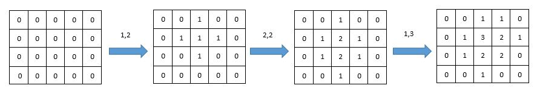
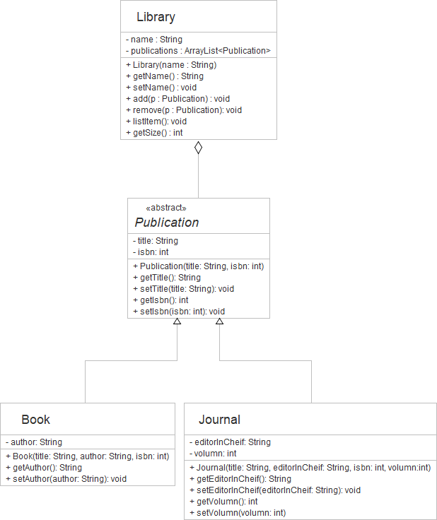

## Question 1  
You have a position in communication squad. Your task is to encrypt a communication message by reverse every word in the message and make every word title case (use upper case for the first letter). The first line of input is number of words in a message. The second line is a message.

### For example:
| **Input**     | **Result** |
|:--------------|:-----------|
| 5 <br> Good Luck to Your Exam | Doog Kcul Ot Ruoy Maxe |
| 8 <br> I will go eat some pizza and tea | I Lliw Og Tae Emos Azzip Dna Aet |
| 3 <br> I Love Java | I Evol Avaj|

## Question 2  
Write a Java program to find the median (middle value) from the given list of numbers. Note: to find the middle value in the list of numbers, the list must be sorted first. If the size of list is even, return 2 numbers which located in the middle of the list.

The first input is a size of list. The second input is a list of number. Hint: use double as datatype.

### For example:
| **Input**     | **Result** |
|:--------------|:-----------|
| 5 <br> 2.3 1 45.2 6.2 77.1|6.2|
|	5 <br> -3.4 5.6 7 8 -33|5.6|
|10<br>-39  234  -644  666  897  806  -313  969  245  -15|234.0 245.0|
|20<br>-59  -19   75  -470  490  -795  189   42  -498  876  908  300  -41  957  337   36  883  -753  -989  960  -416  -648  895  -96  942  -43  -969  -614  -842|42.0 75.0|
|50<br>-338  -484  840  -386  495   57  238  -138  770  662  800  533  -51  -164  -108  -896  362  -823  -112  -854  -531  834  -761  -423   49  -54  813  608  129  -477  155  706  -224  804  -298  998  -172  657  -387  293  158  -445  228  -545    0  383  -650  614  256  -599|0.0 49.0|

## Question 3  
Write a Java program to sort a list of number and then swap according to the following conditions:

1. If the size of list is odd number, then swap the first number with the number before the middle number and swap the last number with the number after the middle number as an example:

  5  21.3  4  10  0.2  15  9     --> sort --> 0.2  4  5  9  10  15  21.3 --> swap --> 5  4  0.2  9  21.3  15  10

2. If the size of list is even number, there will be two numbers in the middle. Then swap the first number with the left middle number, and swap the last number with the right middle number as example:

  5  21.3  4  10  15  9     --> sort --> 4  5  9  10  15  21.3 --> swap --> 9  5  4  21.3  15  10

The first input is a size of a list. The second input is the list of numbers. Use datatype as double.
### For example:
| **Input**     | **Result** |
|:--------------|:-----------|
| 7 <br> 5  21.3  4  10  0.2  15  9|5.0 4.0 0.2 9.0 21.3 15.0 10.0|
| 6<br>5  21.3  4  10  15  9|9.0 5.0 4.0 21.3 15.0 10.0|
|6<br>64  -399  -29  -790  475  854|-29.0 -399.0 -790.0 854.0 475.0 64.0|
|11<br>7  -250  341  137  235  750  136  -83  571  632  -153|136.0 -153.0 -83.0 7.0 -250.0 137.0 750.0 341.0 571.0 632.0 235.0|
|14<br>-142  955  873  -316  -102  806  -894  -362  542  -279  463  667  207  598|207.0 -362.0 -316.0 -279.0 -142.0 -102.0 -894.0 955.0 542.0 598.0 667.0 806.0 873.0 463.0|

## Question 4  
Giving a grid (two-dimensional array) containing numbers, write a program to add up the number by 1 per click to the clicked cell and its adjacent cells (i.e., right cell, left cell, top cell, bottom cell).

For example, giving the array of 4 rows and 5 columns, if the clicked position is at (1,2) (2,2) and (1,3) respectively, the result is shown as below.



The input has three parts. The first part is two numbers indicate row and column and the arrays. The second part is a number indicate number of clicks. The last part is the list of clicked position in a pair of row and column.

### For example:
| **Input**     | **Result** |
|:--------------|:-----------|
|4 5 <br> 3 <br> 1 2 <br> 2 2 <br> 1 3|0 0 1 1 0 <br> 0 1 3 2 1 <br> 0 1 2 2 0 <br> 0 0 1 0 0|
|6 6 <br> 10 <br> 1 1 <br> 5 3 <br> 4 2 <br> 4 1 <br> 3 3 <br> 3 2 <br> 2 5 <br> 5 1 <br> 2 4 <br> 3 3|0 1 0 0 0 0 <br> 1 1 1 0 1 1 <br> 0 1 1 3 2 2 <br> 0 2 4 3 3 1 <br> 1 3 3 4 0 0 <br> 1 2 3 1 1 0|
|5 3 <br> 5 <br> 0 0 <br> 4 2 <br> 3 1 <br> 1 2 <br> 2 2|1 1 1 <br> 1 1 2 <br> 0 2 2 <br> 1 1 3 <br> 0 2 1|
|10 7 <br> 20 <br> 6 5 <br> 3 1 <br> 0 6 <br> 9 2 <br> 2 2 <br> 8 3 <br> 3 1 <br> 6 5 <br> 7 2 <br> 1 5 <br> 6 5 <br> 4 1 <br> 0 6 <br> 9 2 <br> 2 5 <br> 3 3 <br> 2 1 <br> 6 4 <br> 1 2 <br> 1 3|0 0 1 1 0 3 2 <br> 0 2 3 2 2 2 3 <br> 1 4 3 3 1 2 1 <br> 2 4 4 1 1 1 0 <br> 1 3 1 1 0 0 0 <br> 0 1 0 0 1 3 0 <br> 0 0 1 1 4 4 3 <br> 0 1 1 2 1 3 0 <br> 0 0 4 1 1 0 0 <br> 0 2 2 3 0 0 0|

## Question 5  
Giving the UML Class Diagram as below. Write a program according to the given class diagram.



Just like the real-world scenario, a library contains many publications. The class Library will keep publications in an ArrayList named publications. To add a publication, it uses add(Publication p) method to add publication. The logic of adding a publication is to check if the publication is already existed in the ArrayList. If a publication already exists, it will print "The item already exists.". Otherwise, the publication is added to ArrayList. Similarly, to remove a publication, the remove(Publication p) method will check if the ArrayList contains the publication. If it contains the publication, it will remove the publication directly. Otherwise, it will print "The item does not exist."

For the method listItem() of Library, it will list the title of all publications in the ArrayList order by index. Noted that you can use the loop to print each title from the index 0 until the end of the list. In addition, The getSize() method simply returns size of the ArrayList.

Noted that the driver class is provided in the preloaded answer box. Please do not modify the driver class.

```
import java.util.ArrayList;

public class LibraryTester {

    public static void main(String[] args) {
        Library kmuttLib = new Library("KMUTT Library");
        Book b1 = new Book("Harry Potter and the Sorcerer's Stone", "J.K. Rowling", 439708184);
        Book b2 = new Book("The Lord of the Rings", "J.R.R. Tolkien", 544003415);
        Book b3 = new Book("Introduction to Java", "Y. Liang and Y. Daniel Liang", 244073613);
        Journal j11 = new Journal("nature", "Magdalena Skipper", 14764687, 575);
        Journal j12 = new Journal("nature", "Magdalena Skipper", 14764687, 576);
        Journal j13 = new Journal("nature", "Magdalena Skipper", 14764687, 577);
        Journal j21 = new Journal("Business Process Management Journal", "Majed Al-Mashari", 14637154, 25);
        Journal j22 = new Journal("Business Process Management Journal", "Majed Al-Mashari", 14637154, 26);
        Journal j23 = new Journal("Business Process Management Journal", "Majed Al-Mashari", 14637154, 27);
        kmuttLib.add(b1);
        kmuttLib.add(b2);
        kmuttLib.add(j11);
        kmuttLib.add(j12);
        kmuttLib.add(j13);
        kmuttLib.add(j21);
        kmuttLib.add(j22);
        kmuttLib.add(j23);
        kmuttLib.add(j23);
        kmuttLib.remove(j12);
        kmuttLib.remove(j22);
        kmuttLib.remove(b3);
        System.out.println("The KMUTT Library has " + kmuttLib.getSize() + ".");
        kmuttLib.listItem();
    }
}

```
