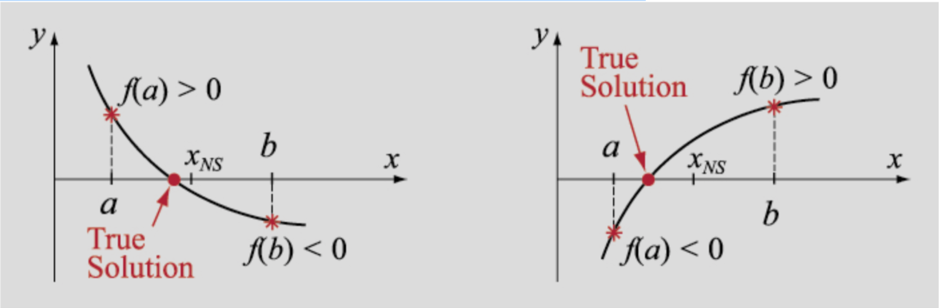
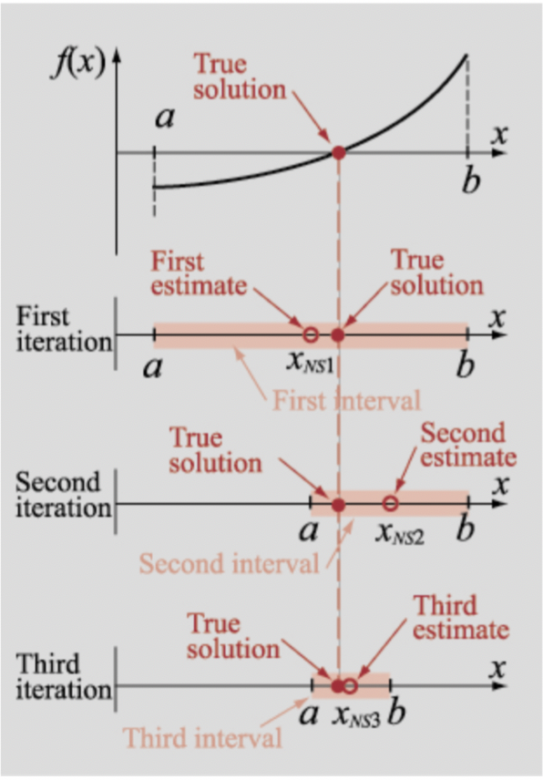
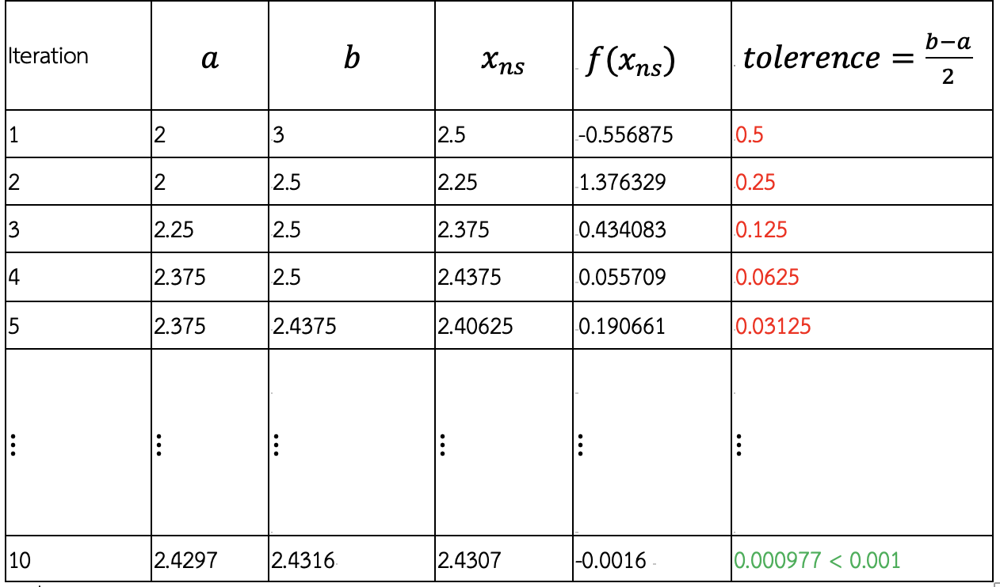

## Question 1  
Write the program to print the given word in the X cross pattern. If the length of the word is not an odd number, then the output will print "Invalid word input".

The input is a word and the output is the word printed in the X cross format or the text "Invalid word input".
### For example:
| **Input**     | **Result** |
|:--------------|:-----------|
|hello|<pre>h   o  e l   l  e l h   o</pre>|
|love|Invalid word input|

## Question 2  
High Table have their own weapon factory. Their blacksmith uses 10 iron ingots to make one sword, 8 ingots for a shield and 3 ingots for a helmet. The blacksmith will try to complete a whole set of equipment first. If there’re any ingots left, the blacksmith will prioritize making a sword, a shield and then a helmet respectively. Your task is to write a program that takes the amount of iron ingots and calculates how many pieces of each type of weapon can be made and how many ingots are left.

The input is the amount of iron ingots. The outputs are number of swords, shields, helmets and remaining ingots respectively.
### For example:
| **Input**     | **Result** |
|:--------------|:-----------|
|25| 1 1 2 1|
|49|2 2 4 1|
|50|2 3 2 0|
|2578|123 122 124 0|
|112456|5355 5355 5355 1|
|4546|217 216 216 0|

## Question 3  
Given the string (no space) you need to print the unique alphabet that found in string in uppercase according to lexical order.
### For example:
| **Input**     | **Result** |
|:--------------|:-----------|
|absdasdeqeuqweiwqeq|A B D E I Q S U W|
|Acollectionthatcontainsnoduplicateelements|A C D E H I L M N O P S T U|
|mailkmuttacth|A C H I K L M T U|
|CompileAndExecuteJava|A C D E I J L M N O P T U V X|
|GoodMorningTeacher|A C D E G H I M N O R T|

## Question 4  
GOTO [https://cscms.sit.kmutt.ac.th/bisection.pdf](https://cscms.sit.kmutt.ac.th/bisection.pdf) if you can't read it correctly.
The pdf is also uploaded [here](bisection.pdf)

Bisection Method is based on splitting x-interval into two halves

IF f(x)  has a root between a and b THEN f(a)×f(b)<0

**Algorithm** 

1. Use the given point of  interval by finding a and b such that f(a)×f(b)<0
2. Calculate the first estimate solution xns = (a+b)/2

3. Determine the range with true solution
4. if f(a)×f(xns)<0, the true solution is between  a and xns
5. if f(a)×f(xns)>0, the true solution is between xns and b
6. Select subinterval obtained from step 3 and go back to step 2 
7. Calculate tolerance by tolerance = (b−a)/2
8. Repeat step 2 to 5 until specified tolerance attained

**Problem**

Use an introduced method to find value of x in equation c1 + c2 (x−sinx). The algorithm must stop when tolerance attained by using a this given argument a, b, c1, c2 and tolerance.

HINT1: use Math.sin(x) to calculate value of sine function.
HINT2: use double for your datatype.

**Example:**

**Input:** 2 3 8 -4.5 0.001

**Output:** 2.4306640625

**Explanation of the Example**

Find the value of x from equation 8−4.5(x−sinx) by using Bisection method with tolerance of less than 0.001 radian.

### For example:
| **Input**     | **Result** |
|:--------------|:-----------|
|2 3 8 -4.5 0.001|2.4306640625|
|2 3 8 -4.5 0.0001|2.43048095703125|
