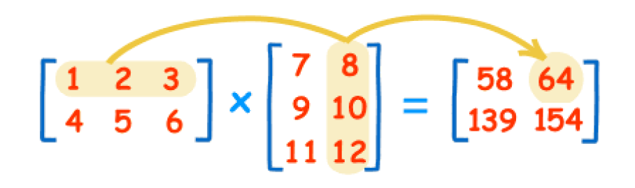
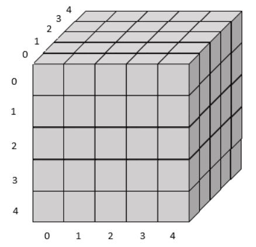
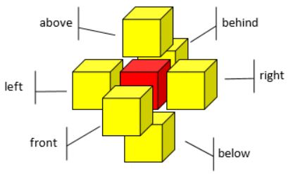

## Question 1  
Write a program to find average of value in a array from the given argument.  
The first line is number of element in the array.  
The second line are elements in the array.
### For example:
| **Input**           | **Result** |
|:----------------------|:------------|
| 10 1 2 3 4 5 6 7 8 9 10 | 5.5 |
| 10 9 64 37 95 20 81 97 48 68 7 | 52.6 |
| 5 62 42 86 21 28  | 47.8 |

## Question 2  
Write a Java program to calculate the sum of the elements in each row of two-dimensional array.  
The first row of input is a dimension of the array (row and column) followed by elements in an array.  
### For example:
| **Input**           | **Result** |
|:----------------------|:------------|
|4 5 16 10 2 21 1 33 49 62 35 9 45 27 15 67 40 52 56 84 18 2 |sum of row#0 is 50 sum of row#1 is 188 sum of row#2 is 194 sum of row#3 is 212|

## Question 3  
Write a program to sort an array  
The fist line of input is a number of element in an array  
The second line is elements in an array
### For example:
| **Input**           | **Result** |
|:----------------------|:------------|
| 10 54 37 15 28 51 69 78 19 23 84 | 15 19 23 28 37 51 54 69 78 84 |
| 5 60 58 61 77 72                | 58 60 61 72 77               |
| 12 95 25 77 75 12 68 35 56 24 87 30 85 | 12 24 25 30 35 56 68 75 77 85 87 95 |

## Question 4  
Write a program to swap elements of the integer array at a specific pair of positions.  
The input consists of (1) size of the array, (2) list of number in the array, (3) number of swap pair, (4) list of swap pair.  
The output is the swapped array.
### For example:
| **Input**           | **Result** |
|:----------------------|:------------|
| 10 860 663 292 838 246 501 760 345 1 891 3 2 4  8 3 5 1|860 501 246 1 292 663 760 345 838 891| 

## Question 5  
Write a program to calculate the average value of each row and column from a given two-dimensional array.  
The input consist of two parts. The first part (the first line) contains two numbers indicating number of rows and columns respectively. The second part contains list of numbers in the array.
### For example:
| **Input**           | **Result** |
|:----------------------|:------------|
| 2 3   1 2 3   4 5 6| Average of each row: 2.0 5.0 Average of each column: 2.5 3.5 4.5|
| 4 3 12 35 2 1 10 9 7 6 19 20 35 60 | Average of each row:  16.333333333333332 6.666666666666667 10.666666666666666 38.333333333333336 Average of each column: 10.0 21.5 22.5|
| 5 5 4 4 4 4 4 8 8 8 8 8 16 16 16 16 16 2 2 2 2 2 32 32 32 32 32 | Average of each row: 4.0 8.0 16.0 2.0 32.0 Average of each column: 12.4 12.4 12.4 12.4 12.4|

## Question 6  
Giving two matrices multiply them and output the result.  
  
The example calculation is (1x8) + (2x10) + (3x12) = 64  
In the above example, the input will become:  
2 3 3 2  
1 2 3 4 5 6  
7 8 9 10 11 12  
The output should be:  
58 64 139 154

Note that we can do the multiplication of the matrix only if the number of columns of the first matrix equals the number of rows of the second matrix. Otherwise, print “Invalid”.  
Each case has three lines. The first line consists of 1) a number of rows of the first matrix, 2) a number of columns of the first matrix, 3) a number of rows of the second matrix, and 4) a number of columns of the second matrix. The second line and the third line contain a list of values from the first row until the last row of the first and the second matrix accordingly. The output is the resulted matrix from the multiplication.
### For example:
| **Input**           | **Result** |
|:----------------------|:------------|
|2 3 3 2 1 2 3 4 5 6 7 8 9 10 11 12|58 64 139 154|
|2 2 3 3 5 6 7 8 9 0 1 2 3 5 8 2 4|Invalid|
|11 6 6 13 14 34 85 89 38 66 30 12 48 5 10 15 5 33 90 6 88 10 39 98 75 85 34 57 11 96 98 23 82 70 68 20 35 50 52 20 21 51 83 93 34 26 51 30 63 3 95 41 5 84 7 91 53 5 76 16 68 99 52 40 89 70 68 4 30 45 1 64 5 64 73 12 33 72 19 51 32 96 82 1 94 16 64 8 98 98 81 98 65 23 57 66 82 15 35 68 12 77 7 84 50 69 50 15 79 48 73 9 26 88 60 45 57 16 63 68 86 89 96 18 22 35 94 2 65 69 20 58 84 34 54 51 24 47 38 15 47 75 51 62 20 52 31 80|18304 14132 8328 15004 14708 18563 15814 21963 14124 17920 18156 15549 25360 5943 4673 2992 7002 4467 6257 4502 8904 5356 6817 5596 5519 9229 16664 7034 6163 12168 10659 11230 10769 17517 10305 14292 13739 7529 15784 16538 21018 8580 19434 16062 23694 21726 27144 19669 22001 18852 20688 29552 20689 16033 10322 19640 13529 21920 22072 27339 20865 21168 19552 14934 27055 11370 11823 4419 11892 15132 9515 11579 16914 8082 13749 13194 14881 18519 15932 15408 6633 14848 14707 18511 14617 21588 13327 18464 16527 16128 23838 16602 9942 6984 14429 14528 10700 14449 20211 11549 15417 15788 12310 19816 10374 16038 3834 10583 14186 14632 16361 16851 11503 15105 13342 15156 17868 17452 16511 6931 16426 20692 15640 15387 23751 11516 19661 19380 20750 27479 11102 15208 6756 17664 11720 15579 15778 22383 15405 16673 12990 16313 22866|
|5 5 5 9 82 65 52 65 9 56 47 59 48 79 73 55 9 20 98 7 93 60 47 13 81 86 35 67 27 36 94 4 28 56 95 34 62 76 31 73 78 58 27 12 95 60 39 31 79 96 33 95 62 42 64 9 49 62 40 28 22 65 14 26 19 23 33 41 50 98 76 11 76 13|9971 20888 13359 10052 13599 16703 12156 14686 10587 9471 18939 14713 11535 18808 18666 10388 17320 8559 7846 16062 10264 10991 16472 16901 9443 16370 9428 7597 15530 15455 9536 10911 9544 12394 12064 5761 10571 21702 14179 11637 14303 17304 13629 16216 11449|
|8 14 14 9 12 75 94 99 21 1 24 34 14 47 48 59 38 27 84 54 3 88 46 10 14 79 92 83 22 12 69 96 35 54 5 19 15 30 68 60 14 93 24 24 13 22 92 15 68 76 91 13 19 81 2 24 17 60 50 70 47 31 50 0 28 22 84 84 47 66 5 12 97 99 0 38 29 49 23 72 28 52 14 3 41 79 26 21 63 0 40 4 99 7 19 64 74 88 22 80 44 58 54 99 7 93 34 41 87 0 50 48 60 82 39 92 78 50 86 92 11 75 0 96 81 35 59 57 45 69 67 68 69 16 65 10 48 44 89 51 61 61 34 60 50 41 26 92 53 32 42 71 48 84 55 27 44 1 73 35 41 4 4 61 25 30 6 62 52 59 52 64 1 64 47 86 28 74 71 57 75 35 35 83 27 55 19 42 80 70 97 67 51 33 92 86 72 43 17 5 78 40 96 94 99 38 47 50 89 41 8 14 24 86 94 10 16 65 23 47 50 2 40 87 42 5 19 80 89 50 77 50 26 79 73 52 70 87 87 34 48 89|29525 24053 28134 27366 39167 31820 28959 34969 32279 43961 39037 38353 43787 45797 41892 40781 46895 44034 22652 21984 18840 26279 24865 28658 25147 31587 26133 36927 32670 34116 33923 41659 33589 29234 36283 40053 37437 31361 27220 41009 42805 39824 37045 40725 36680 18684 18902 24815 18513 27531 19290 21136 24553 28830 35138 31620 34261 36108 35584 32924 35409 40259 39262 38642 37388 40179 40660 43698 44883 34442 49966 50189|
|12 16 13 4 18 14 7 65 11 64 17 43 26 9 65 0 67 14 31 76 6 25 62 64 46 64 41 3 92 49 12 8 37 52 44 98 60 42 26 23 83 46 52 38 31 61 47 17 81 33 25 21 24 73 55 61 26 95 33 82 78 23 3 42 62 96 2 75 57 57 11 21 24 53 7 14 82 41 27 91 86 83 97 0 77 11 29 86 50 35 85 79 19 46 34 71 36 43 33 93 12 50 27 37 58 79 4 28 44 87 35 61 5 76 76 86 1 8 4 10 53 57 29 2 18 54 65 6 75 85 55 10 19 31 77 81 37 22 53 27 71 93 95 72 89 72 3 85 44 73 10 59 79 22 43 63 54 50 39 26 72 36 78 83 44 52 78 12 41 40 0 59 15 10 38 78 46 17 10 37 15 31 27 92 44 3 57 58 62 62 55 42 89 39 31 16 32 39 67 93 94 28 93 15 65 61 33 68 95 5 19 35 55 26 56 14 24 22 85 63 30 22 67 87 72 87 32 48 42 61 27 56 20 27 76 89 16 94 46 24 46 66 64 66 28 50 1 12|Invalid|

## Question 7  
Giving a black rubik 5x5x5 (all pieces of rubik are black at the initial state as shown in the picture below) and toggle positions, write a program to toggle the color between black and white according to the given conditions and return the number of white pieces.

  
  

**Toggle Conditions**  
1. At the selected position, a piece of rubik will be toggled. The adjacent pieces are also toggled. These include the front, the behind, the left, the right, the above, and the below.
2. Each toggle will change the color between black and white. In detail, if the color before toggle is black, the color will be changed to white after the toggle. If the color before toggle is white, the color will be changed from white to black.

The first line of input is number of times to toggle. The following lines represent toggle position. The program must return the number of white pieces after all toggles are performed.
### For example:
| **Input**           | **Result** |
|:----------------------|:------------|
| 1   0 0 0|4|
|2 1 3 2 1 1 2|12|
|4 4 0 0 4 0 4 1 2 3 2 1 1|22|
|5 1 2 3 2 1 1 2 1 1 3 1 4 1 1 3|16|
|10 1 2 3 4 0 4 1 3 2 2 1 1 3 1 4 1 1 3 4 4 4 1 1 1 2 1 4 4 0 1|34|
|15 1 2 3 4 0 4 1 3 2 0 2 0 2 1 1 1 3 0 3 1 4 1 1 3 2 1 4 4 4 4 1 1 1 2 1 4 4 0 1 3 4 0 1 3 4|50|
