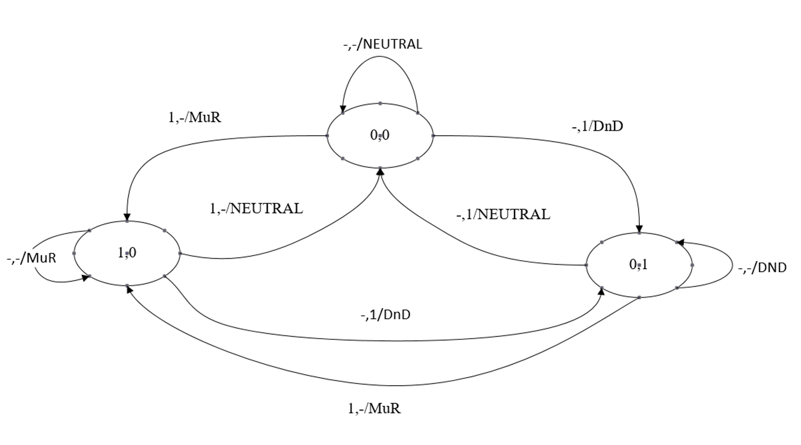
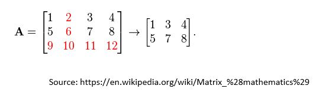
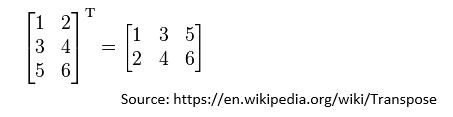

## Question 1
Write the program to print a course which has the most number of registered students.

The input is the list of course and number of registered students pairs. The list ends when it reaches the word "end".

The output is the course with the highest number of registered students. (Hint: the test cases will provide only 1 course having highest number of registered students.)
### For example:
| **Input**     | **Result** |
|:--------------|:-----------|
| CSC102,1 <br> CSC105,5 <br> CSC217,8 <br> CSC102,4 <br> end| CSC217,8 |
| CSC102,3 <br> CSC102,2 <br> CSC220,10 <br> CSC217,7 <br> CSC102,2 <br> LNG320,8 <br> CSC102,10 <br> end|CSC102,17|
|CSC102,3 <br> CSC102,2 <br> CSC220,10 <br> CSC217,7 <br> CSC102,2 <br> LNG320,8 <br> CSC102,10 <br> CSC102,3 <br> CSC102,2 <br> CSC220,10 <br> CSC217,7 <br> CSC102,2 <br> LNG320,8 <br> CSC102,10 <br> CSC102,3 <br> CSC102,2 <br> CSC220,10 <br> CSC217,7 <br> CSC102,2 <br> LNG320,8 <br> CSC102,10 <br> end|CSC102,51|
|CSC102,2 <br> CSC102,5 <br> CSC220,11 <br> CSC217,32 <br> CSC102,6 <br> LNG320,8 <br> CSC102,13 <br> CSC309,40 <br> CSC217,32 <br> CSC102,6 <br> LNG320,8 <br> CSC102,13 <br> CSC309,40 <br> CSC102,2 <br> CSC102,5 <br> end|CSC309,80|
|CSC102,1 <br> CSC105,5 <br> CSC217,8 <br> CSC102,3 <br> CSC102,1 <br> CSC105,5 <br> CSC217,8 <br> CSC102,6 <br> CSC102,11 <br> CSC102,8 <br> CSC105,12 <br> CSC217,8 <br> CSC217,8 <br> CSC102,6 <br> CSC102,11 <br> CSC102,8 <br> CSC105,12 <br> CSC217,8 <br> end|CSC102,55|

## Question 2
There are a certain number of cylinder water tanks which have different size of diameter (m) and length (m).

Write a program to find the ascending order (smallest to largest) of tanks according to their volume.

Hints:

1. To find a volume of a cylinder use the following formula:

    ```math
    V = \pi r^2 h
    ```


    where:

    V = volume

    r = radius (diameter/2)

    h = height

2. Use the value of Pi as 3.14159.

3. Use double as data type.

4. You can use Arrays.sort().

The first line of input consists of number of tanks. The following lines are the information of each tank which includes tank id (integer), diameter (m), and length (m).

### For example:
| **Input**     | **Result** |
|:--------------|:-----------|
| 3 <br> 1 7.4 80 <br> 2 5.2 90 <br> 3 6.4 60 | 2 3 1 |

## Question 3
Mr. Ukrit is a new manager of Continental Hotel, Bangkok. He has to be prepared to welcome the most famous assassin of the continental ground, Mr. John Wick. He develops IoT light switches showing his customer need to inform butlers. These light switches are toggle switches. One of switches has a light signal of “Make Up Room” (MuR). Another one has a light signal of “Do not Disturb” (DnD). These two switches can be both “off”, but either one of them can be “on” at a time. There are two states of signal which are 0 and 1 representing "on" and "off" respectively. 

The input consists of two lines. The first line is a pair of current state representing the on/off status of each switch. The second line is the switch input clicking of MuR switch and DnD switch, each represented by “1” or “-” where "1" represents clicking and "-" represents not clicking. The output is the status of the next state which are either "NEUTRAL" if both switch off, "MuR" if the MuR switch is on, or "DnD" if the DnD switch is on. Examples are provided in the table below.

|Current State<br>(first line of input)|Clicking<br>(second line of input)|Next State<br>(output)|
|:-------------:|:-----------:|:-----------:|
| 0 0 | - 1 | DnD |
| 0 1 | 1 - | MuR |

With these conditions, it can be depicted by using the Finite State Machine diagram shown below.



### For example:
| **Input**     | **Result** |
|:--------------|:-----------|
| 0 0 <br> - -| NEUTRAL |
| 0 0 <br> - 1| DnD |
| 0 0 <br> 1 -| MuR |

## Question 4
Write a program to find a submatrix by deleting a row and a column from a matrix. Then transpose the submatrix.

Hint: A submatrix is obtained by deleting any rows and columns. For example,



To transpose a metrix can be done by switching row and column. For example,



The input of each case has three lines. The first line indicates a size of array (i.e., rows and columns). The second line contains the number of row and column that will be deleted. Note that number of row and column ranged from 0. The third line contains a list of integer values in an array. The output is the result after transposing the submatrix.
### For example:
| **Input**     | **Result** |
|:--------------|:-----------|
| 3 4<br>2 1<br>1 2 3 4 5 6 7 8 9 10 11 12 | 1 5 3 7 4 8 |
| 5 5<br>0 4<br>1 2 3 4 5 6 7 8 9 10 11 12 13 14 15 16 17 18 19 20 21 22 23 24 25|6 11 16 21 7 12 17 22 8 13 18 23 9 14 19 24|

