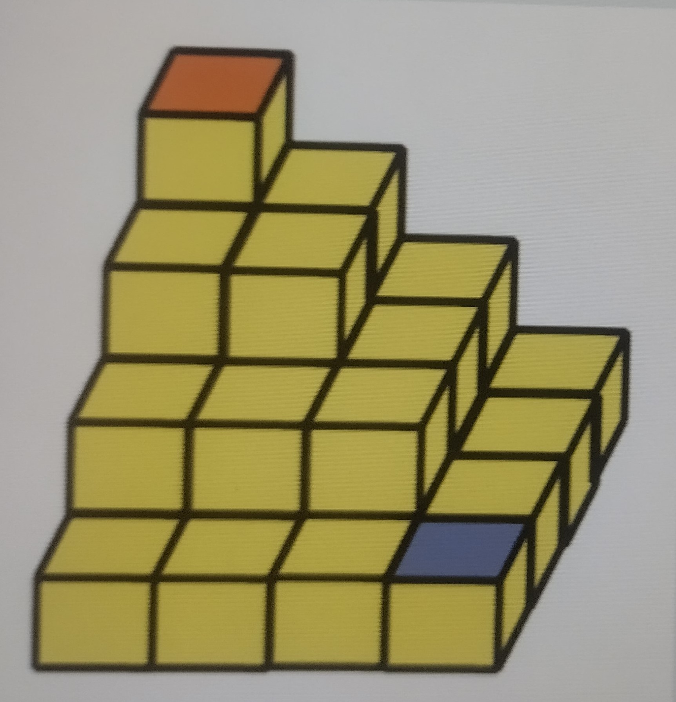

# Terrain Cube Problem
James the minion is a runner who has just won the race. That night, he joined the party. Unfortunately, he was drunk. Actually, James has an uncommon secret behavior that no one knows. When he is drunk, he cannot walk and use the stairs normally. If he walks straight ahead more than 3 steps or goes down the stairs more than 3 steps, he will start to fall and keep rolling like a ball. Every times he decides to move, he must choose either straight walkout or going downstairs. If he does it at the same time, he will fall and roll like a ball as well. Since he is a professional runner, he will use the shortest way. James knows his limitation but he loves party and gets drunk at the end!! When the party finished he must go back to his home. So lucky, the party site is on the hill and his home is at down below!! The terrain between home and party site is like the picture.

The party site is at the orange point and James' house is at the purple point. So, James has to walk downstairs from the party site to his home while he is drunk!! However, James can't remember how many stairs he has to walk down. Fortunately, someone told him that it is N between his home and party site. As example shown in the picture, N is 4. James needs to plan the way to get back to his home wisely. Please... HELP HIM find total possible plans to get back home !!!
Input N is a number of ladder steps where (1 <= N <= 20). The output is the number of plan that James can get back to his home.

### For example:
| **Input** | **Result** |
|:--------- |:-----------|
|1|1|
|2|2|
|3|12|
|4|80|
